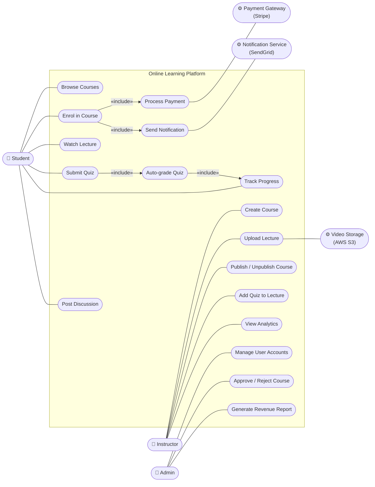
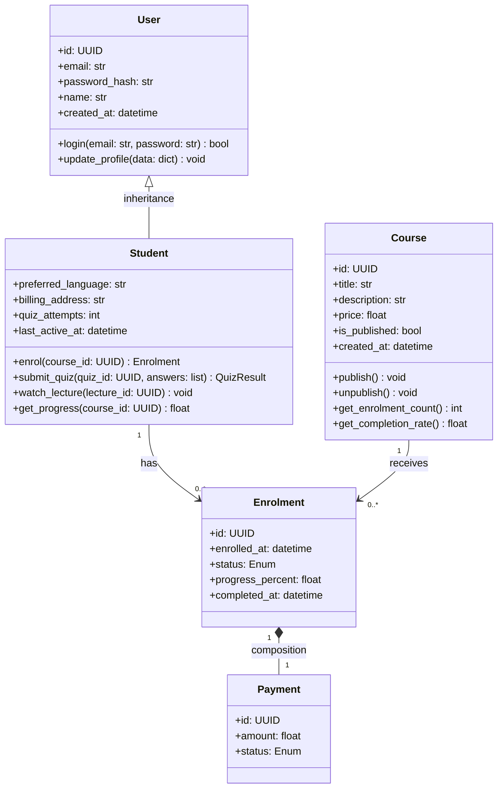

# Tutorial 3 — Sample UML Diagrams

The four UML diagrams produced for the Online Learning Platform scenario in
Tutorial 3 Part 3 (sample answers).

## Use Case Diagram

## Class Diagram

(Truncated — see `tutorial_3.md` for the full answer with Instructor, Admin,
Lecture, Quiz classes.)

## Sequence Diagram — Enrol in Course

See the full Mermaid in `tutorial_3.md` Part 3 sample answer.

## Component Diagram

See the full Mermaid in `tutorial_3.md` Part 3 sample answer.
