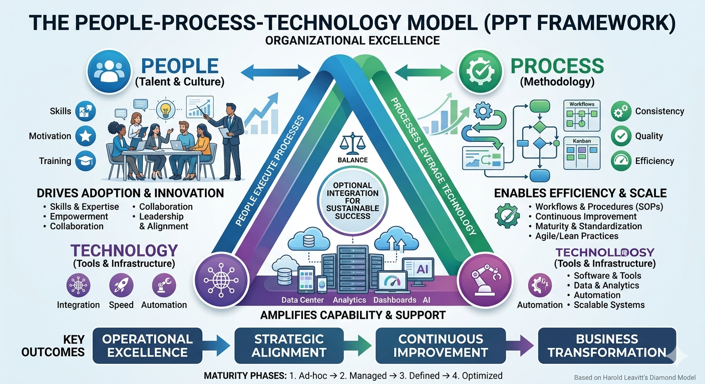
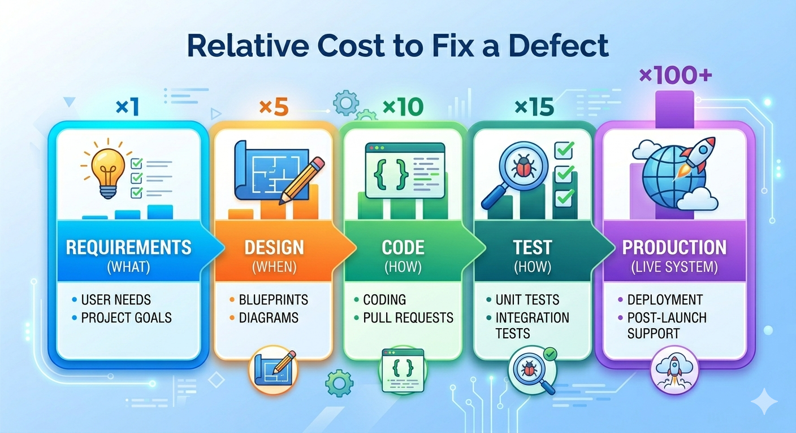
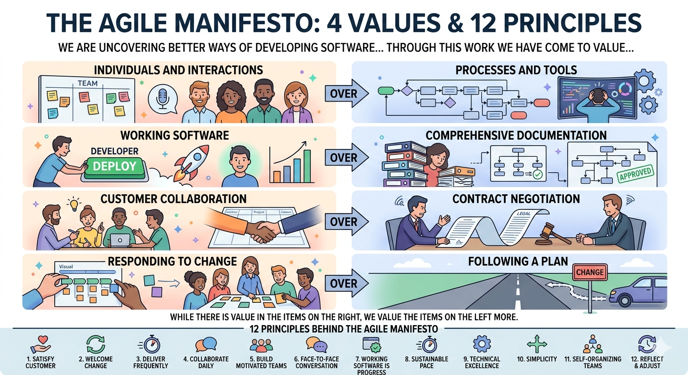
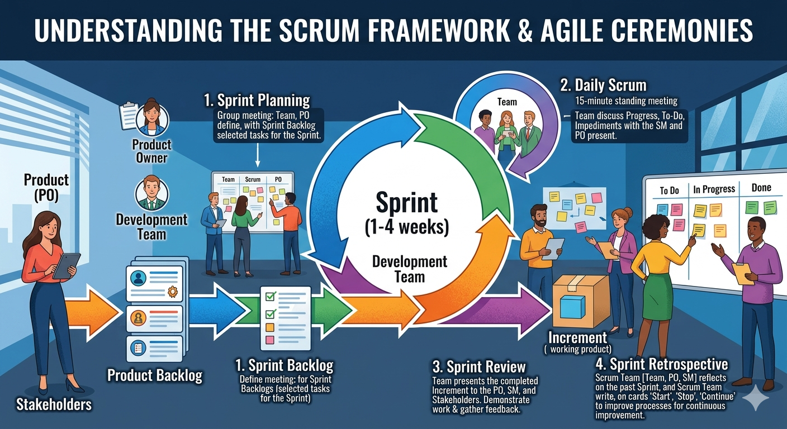
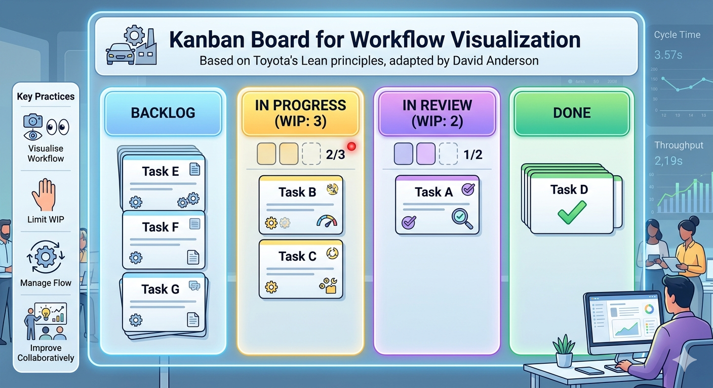

# Chapter 1: Software Engineering Fundamentals and Processes

> *"Software engineering is the establishment of and use of sound engineering principles in order to obtain economically software that is reliable and works efficiently on real machines."*
> — Friedrich Bauer, 1968 NATO Conference

---

In 2012, a software engineer at the Commonwealth Bank of Australia updated code that handled automated deposit machine reporting. The update introduced a bug. Nobody caught it in testing. For the next three years, the bank unknowingly processed transactions that helped criminals launder money — and then paid AUD$700 million to settle the case ([AUSTRAC, 2018](https://www.austrac.gov.au/news-and-media/media-release/austrac-and-cba-agree-700m-penalty)). The engineer was not incompetent. The bank was not reckless. The failure was not technical. It was the absence of the processes, tests, and monitoring that would have surfaced a silent defect before it compounded for three years. That absence — and how to close it — is what software engineering is for.

---

## Learning Objectives

By the end of this chapter, you will be able to:

1. Define software and explain how it differs from hardware and other engineering products.
2. Describe the key attributes of good software and the People–Process–Technology model of software engineering.
3. Identify real-world software engineering failures and the lessons they teach.
4. Compare Waterfall, Incremental, Agile, Scrum, Kanban, and Open Source development — explaining the strengths, weaknesses, and appropriate contexts for each.

---

## 1.1 What Is Software?

**Software** is more than just code. It is the combination of:

- **Programs** — the executable instructions that tell a computer what to do
- **Data** — the information that programs process, including configuration files and databases
- **Documentation** — the materials that describe how to install, use, and maintain the system

This matters because the quality of a software product depends on all three. A perfectly coded program with no documentation is hard to maintain. Poorly designed data structures can cripple an otherwise elegant program.

### Examples of Software Systems

Software underpins virtually every sector of modern life:

| Domain | Example System | Purpose |
|---|---|---|
| **Healthcare** | Electronic Health Record (EHR) | Manage patient data, clinical workflows, prescriptions |
| **Finance** | Online banking platform | Account management, transactions, fraud detection |
| **E-commerce** | Amazon, Shopify | Product catalogue, payments, fulfilment tracking |
| **Transportation** | Uber, Google Maps | Route optimisation, driver dispatch, navigation |
| **Education** | LMS (Moodle, Canvas) | Course delivery, assessment, student progress tracking |

These systems share a common characteristic: they must handle real users, real data, and real consequences when things go wrong. A bug in a spreadsheet script affects one person. A bug in a hospital's prescribing system can endanger lives.

### Generic vs. Customised Products

Software products fall into two broad categories:

- **Generic products** are developed for a broad market and sold to whoever wants them. Examples include Microsoft Office, Adobe Photoshop, and operating systems like Windows. The developer controls the specification.

- **Customised products** (also called bespoke software) are built for a specific client to meet their particular requirements. Examples include a hospital's patient management system or a bank's internal risk platform. The client controls the specification.

The distinction matters for software engineering because it affects who decides what gets built, when it is done, and what constitutes success. Customised projects carry a higher risk of requirements misalignment — the client and developer must invest heavily in understanding each other.

### Why Software Is Different

Software has unique properties that distinguish it from physical engineering products and make it uniquely challenging to build well:

- **Intangible**: You cannot see, touch, or physically measure software. Quality problems can be invisible until they manifest as failures.
- **Malleable**: Unlike a bridge or an engine, software can be changed after deployment — and users expect it to be. This is both a strength and a persistent source of cost.
- **Knowledge-intensive**: Software encodes human knowledge and decision-making. Its complexity scales with the depth of the domain it models.
- **Does not wear out — but it decays**: Hardware degrades physically over time. Software does not rust, but it *decays* as the environment around it changes: operating systems upgrade, dependencies are deprecated, user expectations evolve.

### Unique Challenges

These properties create challenges with no clean parallel in other engineering disciplines:

- **No universal theories or methods.** Civil engineers can consult structural mechanics and established load calculations. Software engineering has no equivalent universal laws — the field lacks a unified theoretical foundation that determines how complex systems should be built.
- **Extraordinarily fast evolution.** Languages, frameworks, and platforms that are standard today may be obsolete in five years. This pace of change means software engineers must be continuous learners.
- **Invisible complexity.** A large software system can contain billions of interacting states. Unlike a physical structure, you cannot visually inspect it for flaws.

These properties mean software engineering has no perfect analogy in civil or mechanical engineering. Fred Brooks captured this in 1987 when he observed that software has no "silver bullet" — no single technique that delivers an order-of-magnitude improvement in productivity, reliability, or simplicity ([Brooks, 1987](https://en.wikipedia.org/wiki/No_Silver_Bullet)).

### The Role of Software in Society

Software is not merely a technical artefact — it is an economic and social force. Technology sectors, of which software is the core, account for a growing share of GDP in developed economies. More critically, essential infrastructure — hospitals, banks, transport networks, power grids — runs on software. When that software fails, the consequences extend far beyond a frustrated user.

Software that fails does not fail quietly. It breaks a city's public transport network, triggers regulatory penalties, or grounds flights. This is why software engineering exists as a discipline — not because writing code is hard, but because the consequences of writing it badly are often borne by people who never saw the source.

---

## 1.2 What Is Software Engineering?

Software engineering is the disciplined application of engineering principles to the design, development, testing, and maintenance of software systems. Unlike informal programming, software engineering emphasises process, quality, collaboration, and long-term maintainability.

The term was deliberately chosen. In 1968, NATO convened a conference in Garmisch, Germany, to address what organisers called the "software crisis" — a widespread recognition that software projects were routinely over budget, delivered late, and unreliable ([Naur & Randell, 1969](http://homepages.cs.ncl.ac.uk/brian.randell/NATO/nato1968.PDF)). The goal of using the word *engineering* was aspirational: to bring to software the same rigour, predictability, and professionalism that civil or mechanical engineers brought to bridges and engines.

That aspiration has guided the field ever since — and it remains relevant today, even as the tools, languages, and collaborators (including AI systems) have changed dramatically. Margaret Hamilton, who led the software team for NASA's Apollo programme in the 1960s, exemplified what this aspiration meant in practice: her team developed the discipline of rigorous, fault-tolerant software engineering at a time when a single defect could mean mission failure or loss of life.

*Photograph from 1968 NATO Software Engineering Conference (University of Newcastle photo)*

### Core Definitions

| Term | Definition |
|---|---|
| **Software** | Programs, data, and documentation that together form a usable system |
| **Software Engineering** | The disciplined application of engineering principles to software development |
| **Software Process** | The structured set of activities required to develop a software system |
| **Software Product** | The artefact produced by the software process — the deployed system and its documentation |

### Computer Science vs. Software Engineering

Computer Science and Software Engineering are related but distinct disciplines — a distinction that was itself a product of the 1960s software crisis:

- **Computer Science** focuses on the theoretical foundations of computation — algorithms, data structures, complexity theory, and the mathematical underpinnings of computing. It asks: *what can be computed, and how efficiently?*

- **Software Engineering** focuses on the practical construction of software systems — how to manage complexity, collaborate in teams, ensure quality, and deliver systems that work reliably in the real world. It asks: *how do we build software that is dependable, efficient, and maintainable at scale?*

The distinction matters. A team fluent in algorithms but unfamiliar with software process will optimise a search function while missing the release deadline. A team fluent in process but ignorant of complexity theory will ship a feature that works on ten users and falls apart on ten thousand.

### The People–Process–Technology Model

Software engineering is often described using the **People–Process–Technology (PPT)** model — sometimes called the "golden triangle" of software development. This framework suggests that for any organisational change or project to be successful, there must be a harmonious balance between these three critical components.

- **People**: The most vital corner of the triangle, representing the developers, architects, testers, product owners, and end-users. This pillar focuses on human capital — the skills, experience, and cultural mindset required to collaborate. While technology can amplify a team's capabilities, it cannot replace human judgement, creativity, or the nuanced communication needed to solve complex problems.

- **Process**: The "how" of the triangle. These are the structured activities and methodologies through which software is built — including requirements gathering, design, implementation, testing, deployment, and maintenance. A strong process ensures that work is repeatable, scalable, and predictable, preventing the chaos that occurs when individuals work in silos.

- **Technology**: The tools, programming languages, frameworks, and infrastructure used to build and support the system. Technology acts as the enabler — it provides the "machinery" to execute the processes. However, without the right people to operate it or the right processes to guide it, even the most advanced tech stack becomes a liability rather than an asset.

The triangle explains a pattern that recurs in troubled projects: a team adopts a new framework or automation tool hoping it will solve their delivery problems, only to find that the new technology demands a level of process discipline or technical skill they have not yet built.

In a healthy ecosystem, these three elements are interdependent. If you move one corner of the triangle without adjusting the others, the structure collapses. Technology choices are visible and exciting, making them easy to prioritise; however, it is the often-invisible failures in people and process that quietly undermine a project until the damage has already compounded.

### Attributes of Good Software

What does it mean for software to be *good*? Sommerville (2016) identifies four essential attributes that characterise high-quality software:

| Attribute | Description |
|---|---|
| **Maintainability** | The software can be evolved to meet changing needs. Since requirements always change, maintainability is fundamental to long-term value. |
| **Dependability and Security** | The software is reliable (fails rarely), safe (does not cause damage), and secure (resists malicious attacks). |
| **Efficiency** | The software does not waste computational resources — memory, processing, energy, or network bandwidth. |
| **Acceptability** | The software is usable by its intended users. It must be understandable, meet their needs, and comply with relevant standards. |

These attributes are not independent. A highly efficient system that users cannot figure out how to operate fails on acceptability. A secure system that crashes daily fails on dependability. Good software engineering requires balancing all four throughout development — not optimising one at the expense of the others.

### The Central Motivation

> **The central question of software engineering is: How do we build high-quality software in a cost-effective way?**

Quality and speed are in tension. Security and simplicity conflict. New features compete with maintenance. Every decision in software development is a negotiation between competing goods — which is why process, judgement, and tooling all matter.

---

## 1.3 When Software Fails

The two cases below are Australian — not because Australian software is unusually bad, but because both are extensively documented in public audit reports and court filings. Read them as patterns, not anomalies. The failure modes recur in every country's software projects.

### Case Study 1: The MYKI Ticketing System

[In 2005, the Victorian Government contracted a consortium to build MYKI — a smartcard-based ticketing system for Melbourne's public transport network.](https://www.audit.vic.gov.au/report/operational-effectiveness-myki-ticketing-system?section=) The project was plagued by problems from the start.

Originally estimated at around AUD$494 million and targeted for full deployment by 2007, MYKI eventually cost over AUD$1.35 billion and was years behind schedule. The Victorian Auditor-General's Office (VAGO) produced multiple critical reports on the project, finding inadequate requirements management, poor contractor oversight, and testing failures that allowed defects to reach passengers (Victorian Auditor-General's Office, 2011).

The MYKI case illustrates several recurring failure patterns:

- **Unclear and unstable requirements**: Scope changed repeatedly, leading to costly rework and disputes
- **Insufficient testing**: Defects were discovered after deployment, when they were most expensive to fix
- **Weak governance**: Problems were not escalated or addressed early enough

### Case Study 2: Commonwealth Bank and Transaction Monitoring

In 2017, Australia's financial intelligence agency AUSTRAC [commenced legal proceedings against the Commonwealth Bank of Australia (CBA)](https://www.austrac.gov.au/news-and-media/media-release/austrac-and-cba-agree-700m-penalty), alleging more than 53,000 breaches of anti-money laundering and counter-terrorism financing laws. At the centre of the case was a software defect.

CBA's Intelligent Deposit Machines (IDMs) — automated cash deposit ATMs — included software required to send threshold transaction reports (TTRs) to AUSTRAC whenever a cash deposit exceeded AUD$10,000. A coding error introduced during a software update in 2012 caused these reports to stop being generated. The defect went undetected for nearly three years, during which time criminals used the machines to launder money. In 2018, CBA settled with AUSTRAC for AUD$700 million — the largest civil penalty in Australian corporate history at the time ([AUSTRAC, 2017](https://www.austrac.gov.au/news-and-media/media-release/austrac-and-cba-agree-700m-penalty)).

The CBA case illustrates a different but equally important class of failure:

- **A single coding error**, undetected in testing, had catastrophic legal and financial consequences
- **No monitoring**: The system provided no alerting when report volumes dropped to zero
- **Compliance requirements** were not adequately translated into verifiable software behaviour

### Lessons from Failures

| Lesson | What It Means |
|---|---|
| **Requirements must be clear and stable** | Ambiguous or moving requirements lead to software that does not meet needs |
| **Testing is not optional** | Defects found in production cost an order of magnitude more than defects found early |
| **Monitor your systems** | Silent failures are dangerous; systems should report on their own health |
| **Cost of failure exceeds cost of quality** | Investing in good engineering is almost always cheaper than recovering from failure |

---

## 1.4 The Software Development Lifecycle (SDLC)

The Software Development Lifecycle (SDLC) is a structured process for planning, creating, testing, and deploying software.

### 1.4.1 Core Activities

While specific SDLC models differ in their structure and emphasis, most share a common set of core activities:

| Activity | Description |
|---|---|
| **Requirements** | Understand what the system should do — from the perspective of users, stakeholders, and regulators |
| **Design and Implementation** | Decide how the system will be structured, then write and integrate the code |
| **Verification and Validation** | *Verification*: Are we building the system right? (testing, reviews) *Validation*: Are we building the right system? (stakeholder review) |
| **Maintenance** | Fix bugs, adapt to new environments, and extend functionality after deployment |

A key insight from decades of software engineering research is that **maintenance dominates cost**. Studies consistently show that 60–80% of total software cost is incurred after initial deployment (Sommerville, 2016). This has profound implications: the decisions made during requirements and design — naming conventions, modularity, documentation — echo through the entire lifetime of a system.

### 1.4.2 The Cost of Change

Another well-established finding is that **the cost of fixing a defect rises dramatically the later it is found**. A requirement error caught in a design review costs relatively little. The same error discovered after deployment may require changes to a live system, database migrations, user retraining, and regulatory notification.

This cost curve is the economic argument for investing in requirements, design, and testing — and for short feedback cycles. The sooner a problem is discovered, the cheaper it is to fix.

From an economic perspective, software and hardware have also swapped their relative costs. In the early days of computing, hardware was the dominant expense. Today, software development and maintenance far exceed hardware costs in most systems — which is why software engineering as a discipline commands serious investment.

### 1.4.3 SDLC Models Overview

No single development process fits every project. The right choice depends on how well requirements are understood upfront, how stable they are likely to remain, team size, risk tolerance, and regulatory context.

| Model | Approach | Best For |
|---|---|---|
| **Plan-driven (Waterfall)** | Sequential phases; each complete before the next | Stable, well-understood requirements |
| **Incremental** | Deliver in functional slices | Partial requirements; early delivery needed |
| **Agile** | Iterative; embrace change | Evolving requirements; fast feedback |
| **Open Source** | Community-driven; distributed contributions | Widely used tools and libraries |

### 1.4.4 Waterfall

The Waterfall model, introduced by Winston Royce in 1970 (though Royce actually presented it as a flawed approach in the same paper ([Royce, 1970](http://www-scf.usc.edu/~csci201/lectures/Lecture11/royce1970.pdf))), organises development as a strict sequence of phases. Each phase must be completed before the next begins. The model assumes requirements can be fully and correctly specified at the start.

**Strengths:**
- Clear milestones and deliverables
- Easy to manage and document
- Works well for projects with stable, well-understood requirements (e.g., certain embedded systems, regulated government contracts)

**Weaknesses:**
- Requirements almost never remain stable
- Errors discovered late are expensive to fix
- Users see no working software until the end
- Poor fit for projects with high uncertainty

### 1.4.5 Incremental Development

Incremental development addresses Waterfall's most critical weakness: users see nothing working until the project is complete. Instead of delivering the entire system at once, the team divides the system into a series of **increments** — functional slices that can be designed, built, and delivered independently.

Each increment adds value. Early increments cover the core functionality; later increments add secondary features. Stakeholders can use and evaluate each increment and provide feedback that shapes subsequent ones.

**Strengths:**
- Users see working software early and can redirect development based on real experience
- Core functionality can be used while secondary features are still being built
- Risk is reduced — if the project is cancelled or budget is cut, at least a working subset has been delivered

**Weaknesses:**
- Requires careful planning to partition the system into coherent, deliverable slices
- The overall architecture must accommodate future increments without requiring major rework
- Harder to manage fixed-price contracts when the full scope is not defined upfront

Incremental development is the conceptual foundation of Agile methods, but it can also be applied alongside a more structured, plan-driven approach.

### 1.4.6 The Moving Target Problem

One of the most persistent challenges in software development is that **requirements change**. This is sometimes called the *moving target problem*.

Requirements change for many legitimate reasons:

- Users discover new needs once they see early versions of the system
- The business environment shifts — market conditions, regulations, or competition
- Technology changes make new approaches possible
- Stakeholders disagree and compromise positions evolve over time

The moving target problem has two dangerous manifestations in practice:

**Feature creep** occurs when new requirements are added to a project incrementally — each one seemingly small and reasonable — until the scope has grown far beyond what was originally planned. Feature creep is among the leading causes of project overruns.

**Regression risk** arises when adding new features or fixing bugs inadvertently breaks existing functionality. Every change to a system is a potential source of new defects. Without systematic testing, regressions go undetected until they reach users. The CBA case above illustrates exactly this: a software update broke existing behaviour, and no one noticed.

Managing the moving target requires processes that can embrace change while also protecting existing functionality — through automated testing, disciplined change management, and short feedback cycles.

### 1.4.7 Limitations of Documentation-Driven Development

A natural response to the moving target problem is to write more comprehensive documentation upfront — detailed specifications that clients sign off on before development begins. This approach, common in Waterfall projects, has well-documented limitations.

**For clients:** Requirements documents are technical artefacts that many non-technical stakeholders cannot meaningfully evaluate. A client may sign off on a 200-page specification without truly understanding what system it describes — only to be disappointed when the software is delivered.

**For developers:** Written requirements are inevitably ambiguous. Natural language is imprecise. Two developers reading the same requirement will often build two different things.

**For the project:** Documentation becomes outdated as soon as implementation begins. A specification written at the start of an 18-month project rarely matches the reality of the system built at the end.

This does not mean documentation is bad — it means documentation alone is insufficient. This insight drove the Agile movement's preference for *working software* and *customer collaboration* over *comprehensive documentation*.

---

## 1.5 Agile Software Development

Agile is not a single methodology but a family of approaches united by the values in the [Agile Manifesto](https://agilemanifesto.org/) — a document authored in 2001 by seventeen software practitioners who were frustrated with heavyweight, documentation-driven processes. The core insight is that software requirements and solutions evolve through collaboration, and that the ability to respond to change is more valuable than adherence to a plan.

The Manifesto articulates four core **values** — each expressed as a preference, not an absolute:

| We value… | …over |
|---|---|
| **Individuals and interactions** | Processes and tools |
| **Working software** | Comprehensive documentation |
| **Customer collaboration** | Contract negotiation |
| **Responding to change** | Following a plan |

Agile teams work in short cycles called *iterations* or *sprints*, typically 1–4 weeks long. Each iteration produces a working, tested increment of software. Stakeholders review the increment and provide feedback that informs the next iteration.

Key Agile **principles** include:

- Deliver working software frequently (weeks, not months)
- Welcome changing requirements, even late in development
- Business people and developers work together daily
- Simplicity — the art of maximising the amount of work *not* done — is essential

Agile values and principles are deliberately abstract — they describe *what* to aim for, not *how* to organise teams or structure work. Specific frameworks fill that gap. The two most widely adopted are **Scrum**, which prescribes a structured sprint cycle with defined roles and ceremonies, and **Kanban**, which takes a more continuous, flow-based approach with fewer fixed rules.

### 1.5.1 Scrum

Scrum is the most widely adopted Agile framework ([Schwaber & Sutherland, 2020](https://scrumguides.org/scrum-guide.html)). It defines specific roles, events, and artefacts:

**Roles:**
- **Product Owner**: Represents stakeholders; owns and prioritises the product backlog
- **Scrum Master**: Facilitates the process; removes impediments; coaches the team
- **Development Team**: Self-organising group that delivers the increment

**Events:**
- **Sprint**: A time-boxed iteration of 1–4 weeks
- **Sprint Planning**: The team selects backlog items and plans the sprint
- **Daily Scrum**: A 15-minute daily standup to synchronise and identify blockers
- **Sprint Review**: The team demonstrates the increment to stakeholders
- **Sprint Retrospective**: The team reflects on the process and identifies improvements

**Artefacts:**
- **Product Backlog**: An ordered list of everything that might be needed in the product
- **Sprint Backlog**: The backlog items selected for the current sprint, plus the delivery plan
- **Increment**: The sum of all completed backlog items at the end of a sprint

### 1.5.2 Kanban

Kanban, adapted from Toyota's manufacturing system by David Anderson ([Anderson, 2010](https://kanbanbooks.com/)), is a flow-based method that focuses on visualising work, limiting work in progress (WIP), and continuously improving flow.

A Kanban board visualises work as cards moving through columns:

**Key Kanban practices:**
- **Visualise the workflow**: Make all work and its status visible
- **Limit WIP**: Prevent overloading; finish before starting more
- **Manage flow**: Track cycle time and throughput; identify bottlenecks
- **Improve collaboratively**: Use data to drive continuous improvement

Kanban suits teams with highly variable incoming work (e.g., support and maintenance teams) or those who want a lighter-weight alternative to Scrum's ceremonies.

---

## 1.6 Rapid Prototyping

Agile addresses many of Waterfall's rigidities, but it still assumes that stakeholders can articulate what they want — at least well enough to write user stories and prioritise a backlog. In practice, users often cannot describe their needs accurately until they have something concrete to react to. Sprint reviews help, but even a four-week sprint is long enough for a team to build in the wrong direction if the initial requirements were unclear. Agile reduces the cost of late changes; it does not eliminate misunderstanding at the outset. Rapid prototyping is a technique — applicable across all process models — that addresses this gap.

**Rapid prototyping** means building a quick, rough version of the system (or a key part of it) to get feedback before committing to full implementation.

A prototype is not a finished product. It is a communication and learning tool:

- **Throwaway prototypes** are built quickly, shown to stakeholders for feedback, and then discarded. The code is not production-quality; its purpose is to validate understanding.
- **Evolutionary prototypes** are built incrementally and progressively refined into the final system.

Rapid prototyping helps because users can react to something they can *see and use* far more effectively than to something they can only *read about*. It surfaces misunderstandings early — when they are cheap to correct — rather than late, when they are expensive.

---

## 1.8 Open Source Development

Open source development is a model in which source code is made publicly available and developed collaboratively by a distributed community of contributors. Anyone can inspect, use, modify, and distribute the software, subject to the terms of its licence.

The modern open source movement traces its roots to the GNU project (Richard Stallman, 1983) and gained enormous momentum with the creation of the Linux kernel by Linus Torvalds in 1991. Today, open source software powers much of the internet's infrastructure — from web servers (Apache, Nginx) to programming languages (Python, Ruby) to mobile operating systems (Android, which is built on the Linux kernel).

Key characteristics of open source development:

- **Community-driven**: Contributions come from individuals and organisations with diverse motivations — learning, reputation, commercial interest, and ideology
- **Distributed**: Contributors may be scattered across the world, working asynchronously
- **Transparent**: Code, issues, and discussions are publicly visible — anyone can review
- **Release early, release often**: Rapid iteration and public feedback replace formal specification

Open source raises interesting software engineering challenges: how do you maintain quality when anyone can contribute? How do you make architectural decisions by committee? These challenges have driven the development of code review workflows, continuous integration, and community governance models — many of which are now standard practice in commercial software development as well.

---

## 1.9 Key Takeaways

Software engineering is a young discipline that is still evolving — but it has accumulated hard-won wisdom from decades of successes and failures. The key ideas from this chapter:

1. **Software is not just code.** It is programs, data, and documentation — all of which must be engineered carefully.

2. **Software is different from other engineering products.** It is intangible, malleable, and knowledge-intensive. There are no universal theories, the field evolves rapidly, and strategies from civil engineering do not map cleanly onto software development.

3. **Good software has four essential attributes**: maintainability, dependability and security, efficiency, and acceptability. These must be balanced throughout development.

4. **People, Process, and Technology must work together.** No single tool or framework saves a project on its own. The human and organisational dimensions of software engineering are as important as the technical ones.

5. **Software engineering has a history worth knowing.** From the 1968 NATO conference to Margaret Hamilton's Apollo software to the Agile Manifesto, the field's practices are responses to real and costly problems.

6. **Failures are expensive and instructive.** The MYKI and CBA cases show that software failures carry serious financial, social, and regulatory consequences — and that they are preventable with disciplined engineering.

7. **Process choice matters.** Waterfall, Incremental, Agile, and Open Source each fit different contexts. Choosing the wrong model for a project is itself an engineering mistake.

8. **Change is inevitable.** Requirements move, technology evolves, and organisations change. Good software engineering practices — version control, testing, modular design, short iterations — are responses to this reality.

---

## Review Questions

1. A client asks you to build a custom payroll system. They say their requirements are "pretty clear." What questions would you ask before recommending Waterfall vs. an Incremental approach?

2. The CBA case involved a coding error that went undetected for nearly three years. Identify two software engineering practices from this chapter that, if applied, could have caught the defect earlier.

3. A developer tells a colleague: "We're Agile, so we don't need to document the API — the code *is* the documentation." Three months later the developer leaves, and no one can maintain the integration. Identify where the Agile value was misread, and explain what the Manifesto actually says about documentation.

4. A startup team of four developers argues they do not need Scrum — they prefer to "just write code." Using the People–Process–Technology model, explain what risks this approach carries and what lightweight process elements you would recommend.

5. Compare feature creep and regression risk. Give one example of each from real software projects (they do not need to be from this chapter), and explain how each would be managed differently.