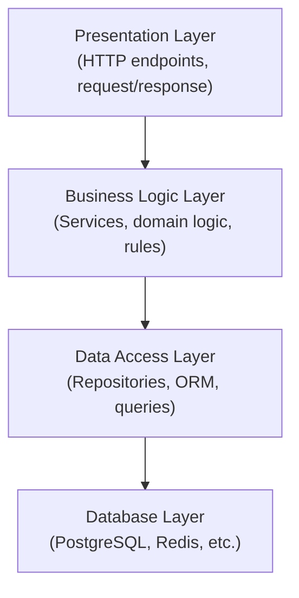
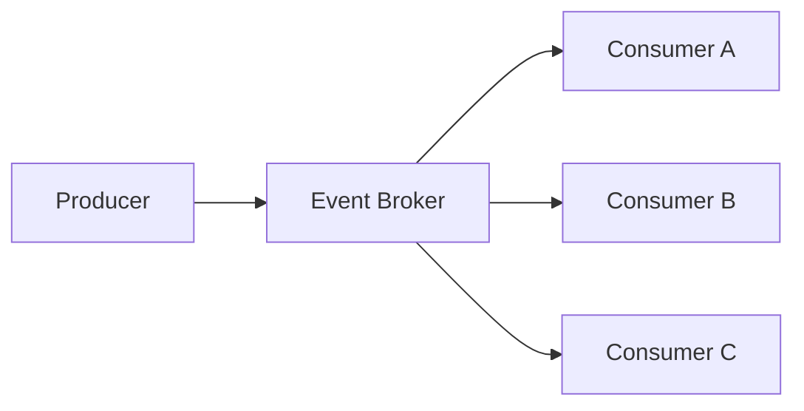
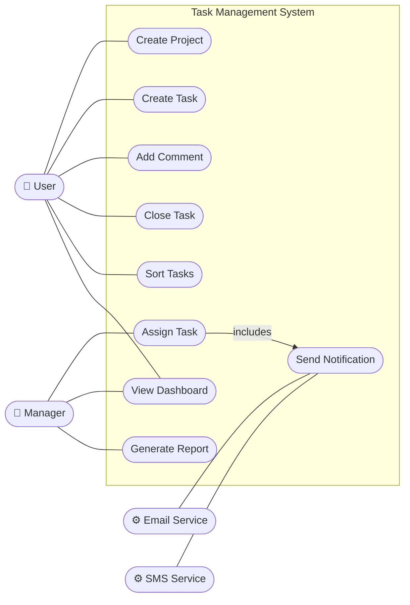
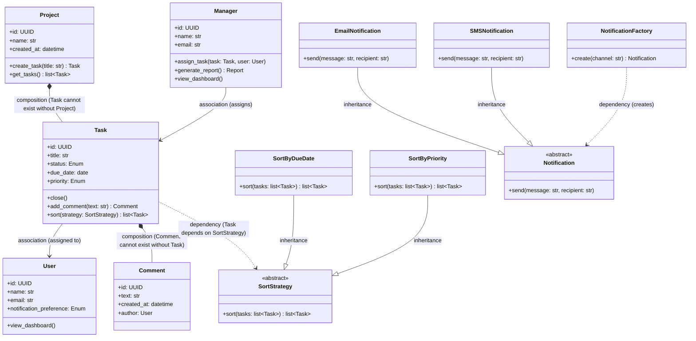
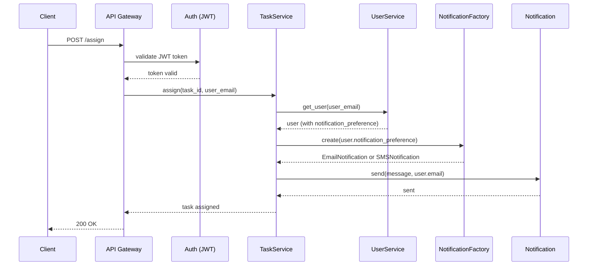
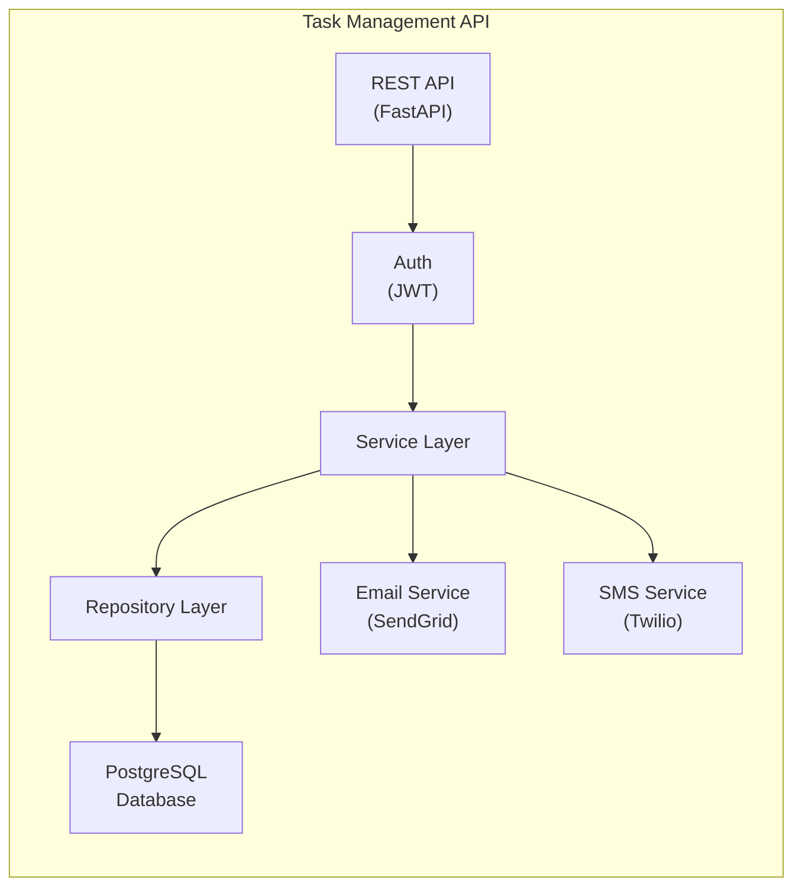

# Chapter 3: Software Design, Architecture, and Patterns

> *"A designer knows he has achieved perfection not when there is nothing left to add, but when there is nothing left to take away."*
> — Antoine de Saint-Exupéry

---

On 1 August 2012, Knight Capital Group — one of the largest equity trading firms in the United States — deployed new software to its production servers. The deployment was manual, and a technician failed to update one of the eight servers. That server continued running a deprecated trading algorithm called "Power Peg," code that had not been active for years but had never been removed from the codebase. When markets opened at 9:30 a.m., Knight's system began placing buy and sell orders at a rate of thousands per second. Within 45 minutes it had executed four million trades, accumulated a $7 billion position, and lost $440 million. The firm needed an emergency capital injection to survive and was acquired six months later ([SEC, 2013](https://www.sec.gov/litigation/admin/2013/34-70694.pdf)).

The failure had nothing to do with clever algorithms or obscure hardware. It was a design failure: dead code left in the codebase, no automated deployment verification, a manual process with no rollback mechanism, and no circuit-breaker that would halt trading on anomalous volume. Every one of those weaknesses is addressable by practices covered in this chapter and the chapters that follow. Good software design does not prevent all failures — but it closes the gaps that turn a deployment error into a company-ending event.

---

## Learning Objectives

By the end of this chapter, you will be able to:

1. Apply SOLID principles and other design guidelines to produce maintainable code.
2. Identify and apply common Gang of Four design patterns.
3. Compare and select appropriate architectural patterns for a given system.
4. Read and produce UML diagrams: use case, class, sequence, and component diagrams.
5. Write clean, readable Python code following established conventions.

---

## 3.1 Why Design Matters

Writing code that works is necessary but not sufficient. Code must also be maintainable — readable and modifiable by other developers (and by your future self) over months and years. Poor design decisions made early in a project compound over time: a monolithic module that is difficult to test becomes more difficult to test as it grows; a tangled dependency structure becomes harder to untangle as more code depends on it.

Software design is the activity of deciding *how* a system will be structured before (or alongside) the activity of writing code. Good design:

- Makes the system easier to understand
- Makes the system easier to test
- Makes the system easier to change in response to new requirements
- Reduces the risk of introducing bugs when modifying existing functionality

This chapter builds that understanding from the inside out. We begin with the principles that define *what makes a design good*, then examine the named patterns that encode those principles as reusable solutions, then the architectural strategies that compose those patterns at the scale of an entire system, and finally the notation used to communicate all of it. Each layer depends on the one before it — a pattern that cannot be explained in terms of a principle is a recipe, not a design.

---

## 3.2 Design Principles

Before reaching for a named pattern or an architectural blueprint, a developer needs values — a set of guidelines that make it possible to reason about whether a design is getting better or worse. Design principles play that role. They do not tell you *what* to build; they tell you *how to judge* what you build.

### 3.2.1 SOLID Principles

The SOLID principles ([Martin, 2000](https://web.archive.org/web/20150906155800/http://www.objectmentor.com/resources/articles/Principles_and_Patterns.pdf)) are five guidelines for writing maintainable object-oriented code:

**S — Single Responsibility Principle (SRP)**

> A class should have only one reason to change.

A class that handles HTTP parsing, business logic, *and* database queries will need to change whenever any of those three concerns changes. Separating them into different classes means each has one reason to change.

```python
# Violates SRP — this class does too much
class TaskService:
    def create_task(self, title: str, user_id: str) -> dict:
        # Business logic
        if not title.strip():
            raise ValueError("Title cannot be empty")
        # Database access (should be in repository)
        db.execute("INSERT INTO tasks ...")
        # Email sending (should be in notification service)
        smtp.send_email(user_id, "Task created")
        return {"id": "...", "title": title}
```

**O — Open/Closed Principle (OCP)**

> Software entities should be open for extension, but closed for modification.

You should be able to add new behaviour without modifying existing code. The Strategy pattern in Section 3.3.4 is a direct application of OCP: new sort strategies can be added without modifying `TaskList`.

**L — Liskov Substitution Principle (LSP)**

> Objects of a subclass should be substitutable for objects of the superclass without altering program correctness.

If `InMemoryTaskRepository` is a subclass of `TaskRepository`, any code that works with `TaskRepository` must work identically with `InMemoryTaskRepository`. Violating LSP typically indicates that the inheritance relationship is wrong.

**I — Interface Segregation Principle (ISP)**

> Clients should not be forced to depend on interfaces they do not use.

Rather than one large interface, prefer several small, focused ones. A `ReadOnlyTaskRepository` interface (with only `find_by_id` and `find_all`) is more appropriate for a reporting service than a full `TaskRepository` that includes `save` and `delete`.

**D — Dependency Inversion Principle (DIP)**

> High-level modules should not depend on low-level modules. Both should depend on abstractions.

```python
# Violates DIP — TaskService depends directly on the concrete PostgreSQL implementation
class TaskService:
    def __init__(self) -> None:
        self.repo = PostgresTaskRepository()  # concrete dependency

# Follows DIP — TaskService depends on the abstract interface
class TaskService:
    def __init__(self, repo: TaskRepository) -> None:
        self.repo = repo  # injected abstraction
```

This is *dependency injection* — the concrete implementation is passed in from outside, typically by an application container. It makes `TaskService` testable with `InMemoryTaskRepository`.

### 3.2.2 DRY: Don't Repeat Yourself

> Every piece of knowledge must have a single, unambiguous, authoritative representation within a system. ([Hunt & Thomas, 1999](https://pragprog.com/titles/tpp/the-pragmatic-programmer/))

Duplicated code is duplicated knowledge. When the logic changes (and it will), you must find and update every copy. The solution is not always to extract a function — sometimes the duplication is accidental and the two pieces of code will diverge. Use judgment: extract when the duplication represents the *same concept*, not just the same syntax.

### 3.2.3 Composition Over Inheritance

Prefer composing objects from smaller, focused components over building deep inheritance hierarchies. Inheritance creates tight coupling between parent and child; composition allows components to be mixed and matched.

### 3.2.4 Hollywood Principle

> "Don't call us, we'll call you."

High-level components should control when and how low-level components are used, not the reverse. This is the principle behind inversion of control (IoC) frameworks and the Observer pattern.

---

## 3.3 Design Patterns (Gang of Four)

Principles tell you what to aim for; patterns show you how to get there. In 1994, Gamma, Helm, Johnson, and Vlissides catalogued 23 recurring design problems and their solutions in *Design Patterns: Elements of Reusable Object-Oriented Software* ([Gamma et al., 1994](https://en.wikipedia.org/wiki/Design_Patterns)) — a catalog that has remained in print and in use for thirty years. The "Gang of Four" (GoF) organised the patterns into three categories:

- **Creational**: How objects are created
- **Structural**: How objects are composed
- **Behavioural**: How objects interact and distribute responsibility

Notice how each pattern in this section is a direct encoding of the principles above. The Factory Method enforces OCP by letting you add new types without modifying existing creation logic. Strategy encodes OCP and DIP by depending on an abstraction rather than a concrete algorithm. Repository applies DIP to persistence. Keeping this connection visible is the point: patterns are not recipes to memorise — they are names for principled solutions.

We cover the patterns most commonly encountered in Python backend development.

### 3.3.1 Singleton (Creational)

Ensures a class has only one instance and provides a global access point to it.

**Use case**: Database connection pools, configuration objects, logging instances.

```python
# singleton.py
class DatabaseConnection:
    _instance: "DatabaseConnection | None" = None

    def __new__(cls) -> "DatabaseConnection":
        if cls._instance is None:
            cls._instance = super().__new__(cls)
            cls._instance._connect()
        return cls._instance

    def _connect(self) -> None:
        # Initialise the connection once
        self.connection = "connected"  # placeholder

    def query(self, sql: str) -> list:
        # Execute query using self.connection
        return []


# Both variables point to the same instance
db1 = DatabaseConnection()
db2 = DatabaseConnection()
assert db1 is db2  # True
```

**Caution**: Singletons introduce global state, which can make testing difficult. In Python, dependency injection (passing the instance explicitly) is often preferable.

### 3.3.2 Factory Method (Creational)

Defines an interface for creating objects but lets subclasses decide which class to instantiate.

**Use case**: Creating notification objects (email, SMS, push) based on user preference.

```python
# factory.py
from abc import ABC, abstractmethod


class Notification(ABC):
    @abstractmethod
    def send(self, message: str, recipient: str) -> None: ...


class EmailNotification(Notification):
    def send(self, message: str, recipient: str) -> None:
        print(f"Sending email to {recipient}: {message}")


class SMSNotification(Notification):
    def send(self, message: str, recipient: str) -> None:
        print(f"Sending SMS to {recipient}: {message}")


def create_notification(channel: str) -> Notification:
    """Factory function — returns the appropriate Notification subclass."""
    channels: dict[str, type[Notification]] = {
        "email": EmailNotification,
        "sms": SMSNotification,
    }
    if channel not in channels:
        raise ValueError(f"Unknown notification channel: {channel}")
    return channels[channel]()


# Usage
notifier = create_notification("email")
notifier.send("Your task has been assigned.", "alice@example.com")
```

### 3.3.3 Observer (Behavioural)

Defines a one-to-many dependency between objects so that when one object changes state, all its dependents are notified automatically.

**Use case**: Event systems, UI data binding, notification pipelines.

```python
# observer.py
from abc import ABC, abstractmethod


class EventListener(ABC):
    @abstractmethod
    def on_event(self, event: dict) -> None: ...


class TaskEventBus:
    def __init__(self) -> None:
        self._listeners: list[EventListener] = []

    def subscribe(self, listener: EventListener) -> None:
        self._listeners.append(listener)

    def publish(self, event: dict) -> None:
        for listener in self._listeners:
            listener.on_event(event)


class EmailNotifier(EventListener):
    def on_event(self, event: dict) -> None:
        if event.get("type") == "task_assigned":
            print(f"Email: task {event['task_id']} assigned to {event['assignee']}")


class AuditLogger(EventListener):
    def on_event(self, event: dict) -> None:
        print(f"Audit log: {event}")


# Usage
bus = TaskEventBus()
bus.subscribe(EmailNotifier())
bus.subscribe(AuditLogger())

bus.publish({"type": "task_assigned", "task_id": "123", "assignee": "alice"})
```

### 3.3.4 Strategy (Behavioural)

Defines a family of algorithms, encapsulates each one, and makes them interchangeable.

**Use case**: Sorting algorithms, payment processing, priority calculation.

```python
# strategy.py
from abc import ABC, abstractmethod
from dataclasses import dataclass
from datetime import date


@dataclass
class Task:
    id: str
    title: str
    due_date: date
    priority: int  # 1 (low) to 4 (critical)


class SortStrategy(ABC):
    @abstractmethod
    def sort(self, tasks: list[Task]) -> list[Task]: ...


class SortByDueDate(SortStrategy):
    def sort(self, tasks: list[Task]) -> list[Task]:
        return sorted(tasks, key=lambda t: t.due_date)


class SortByPriority(SortStrategy):
    def sort(self, tasks: list[Task]) -> list[Task]:
        return sorted(tasks, key=lambda t: t.priority, reverse=True)


class TaskList:
    def __init__(self, strategy: SortStrategy) -> None:
        self._strategy = strategy

    def set_strategy(self, strategy: SortStrategy) -> None:
        self._strategy = strategy

    def get_sorted(self, tasks: list[Task]) -> list[Task]:
        return self._strategy.sort(tasks)
```

### 3.3.5 Repository (Architectural Pattern)

While not in the original GoF catalog, the Repository pattern ([Fowler, 2002](https://martinfowler.com/eaaCatalog/repository.html)) is essential in modern backend development. It abstracts the data access layer, presenting a collection-like interface to the domain model.

```python
# repository.py
from abc import ABC, abstractmethod
from uuid import UUID
from dataclasses import dataclass
from datetime import date


@dataclass
class Task:
    id: UUID
    title: str
    due_date: date | None = None


class TaskRepository(ABC):
    """Abstract repository — defines the interface."""

    @abstractmethod
    def find_by_id(self, task_id: UUID) -> Task | None: ...

    @abstractmethod
    def find_all_by_project(self, project_id: UUID) -> list[Task]: ...

    @abstractmethod
    def save(self, task: Task) -> Task: ...

    @abstractmethod
    def delete(self, task_id: UUID) -> None: ...


class InMemoryTaskRepository(TaskRepository):
    """In-memory implementation — used in tests."""

    def __init__(self) -> None:
        self._store: dict[UUID, Task] = {}

    def find_by_id(self, task_id: UUID) -> Task | None:
        return self._store.get(task_id)

    def find_all_by_project(self, project_id: UUID) -> list[Task]:
        return list(self._store.values())  # simplified

    def save(self, task: Task) -> Task:
        self._store[task.id] = task
        return task

    def delete(self, task_id: UUID) -> None:
        self._store.pop(task_id, None)
```

The key benefit: services depend on the abstract `TaskRepository`, not on a specific database implementation. Swapping PostgreSQL for SQLite in tests requires only a different concrete class.

---

## 3.4 Architectural Patterns

Individual patterns solve problems within a class or a module. Architecture solves problems across an entire system — how components are divided, how they communicate, and how the system will respond when requirements change or load grows. Architectural decisions inherit the same principles (SRP, DIP, OCP) but apply them at a different scale: the "class" becomes a service, the "method" becomes an API endpoint, and the "dependency" becomes a network call.

An architectural pattern is a high-level strategy for organising the major components of a system. Selecting the right pattern is a decision that typically cannot be reversed without rewriting large portions of the codebase — and the wrong choice compounds every subsequent design decision built on top of it.

### 3.4.1 Layered (N-Tier) Architecture

The layered pattern organises a system into horizontal layers, where each layer serves the layer above it and depends only on the layer below it ([Buschmann et al., 1996](https://www.wiley.com/en-us/Pattern+Oriented+Software+Architecture%2C+Volume+1%2C+A+System+of+Patterns-p-9780471958697)).



**Strengths:** Simple to understand; good separation of concerns; easy to test each layer independently.

**Weaknesses:** Can lead to "pass-through" layers that add no logic; performance overhead from passing data through many layers; tendency toward monolithic deployment.

**Suitable for:** Business applications, CRUD-heavy APIs, systems where the team is primarily familiar with this pattern.

### 3.4.2 Model-View-Controller (MVC)

MVC separates a system into three components ([Reenskaug, 1979](https://folk.universitetetioslo.no/trygver/themes/mvc/mvc-index.html)):

- **Model**: The data and business logic
- **View**: The presentation layer (what the user sees)
- **Controller**: Handles user input and coordinates Model and View

MVC is widely used in web frameworks: Django, Ruby on Rails, and Spring MVC all implement variants of this pattern.

### 3.4.3 Event-Driven Architecture

In an event-driven architecture, components communicate by producing and consuming events rather than calling each other directly. An *event broker* (such as Apache Kafka or RabbitMQ) decouples producers from consumers.



**Strengths:** High decoupling; components can scale independently; easy to add new consumers without modifying producers.

**Weaknesses:** Harder to reason about system state; distributed tracing is complex; eventual consistency requires careful handling.

**Suitable for:** High-throughput systems, microservices that need loose coupling, real-time notification systems, audit log pipelines.

### 3.4.4 Microservices

A microservices architecture decomposes a system into small, independently deployable services, each responsible for a single bounded domain ([Newman, 2015](https://www.oreilly.com/library/view/building-microservices/9781491950340/)). Each service has its own database and communicates with others via APIs or events.

**Strengths:** Services can be deployed, scaled, and rewritten independently; teams can work autonomously on separate services; fault isolation.

**Weaknesses:** Significant operational complexity (service discovery, distributed tracing, network latency, eventual consistency); not appropriate for small teams or early-stage products.

**Suitable for:** Large teams (multiple squads, each owning a service); systems where different components have very different scaling requirements.

### 3.4.5 Monolithic Architecture

A monolith is a single deployable unit containing all the system's functionality. Despite its reputation, a well-structured monolith is often the right choice for small teams and early-stage systems ([Fowler, 2015](https://martinfowler.com/bliki/MonolithFirst.html)).

**Strengths:** Simple to develop, test, and deploy; no network latency between components; easy to refactor across the codebase.

**Weaknesses:** Entire system must be redeployed for any change; scaling requires scaling the entire application; risk of components becoming tightly coupled over time.

**The "Monolith First" principle**: Start with a well-structured monolith. Extract services only when you have clear evidence that a specific component needs independent scaling or when team boundaries demand it.

---

## 3.5 UML Diagrams

Once you have chosen the principles, patterns, and architecture for a system, you need a way to communicate those decisions to the rest of the team — across disciplines, across time zones, and across the months between the initial design and the eventual code review. The Unified Modeling Language (UML) provides that shared vocabulary ([OMG, 2017](https://www.omg.org/spec/UML/2.5.1/)). It is a standardised notation for visualising software systems, designed to be precise enough that two developers reading the same diagram reach the same understanding.

We focus on four diagram types that are most commonly used in practice. To make each diagram concrete and comparable, all four examples in this section are drawn from the same system — a project management tool whose requirements are described in the scenario below. Read the scenario once, then refer back to it as you study each diagram type.

**Example — Project Management Tool:**

**Scenario:** A project management tool has two human actors — a **User** and a **Manager** — and two external system actors — an **Email Service** (SendGrid) and an **SMS Service** (Twilio). The system is built as a REST API using FastAPI, stores data in a **PostgreSQL** database, and requires all requests to be authenticated via JWT tokens before reaching the service layer. Users can create projects, create tasks within those projects, add comments to tasks, close tasks, sort tasks by different strategies (due date or priority), and view a shared dashboard. Managers can assign tasks to users, view the dashboard, and generate reports. Whenever a manager assigns a task, the system looks up the recipient's notification preference and automatically sends a notification through either SendGrid or Twilio.

### 3.5.1 Use Case Diagrams

Use case diagrams show the interactions between *actors* (users or external systems) and the *use cases* (features) a system provides. They communicate system scope at a high level and are useful for stakeholder communication early in a project.

**Elements:**
- **Actor**: A stick figure representing a user role or external system
- **Use case**: An oval representing a system function
- **Association**: A line connecting an actor to the use cases they participate in
- **System boundary**: A rectangle enclosing all use cases in scope

**Example — Task Management System:**

The use case diagram below maps the scenario's four actors to the nine features they interact with. Notice how `Assign Task` includes `Send Notification` — capturing the rule that every assignment automatically triggers a notification.



Use case diagrams intentionally omit implementation detail — they show *what* the system does, not *how*.

### 3.5.2 Class Diagrams

Class diagrams show the static structure of a system — the classes, their attributes and methods, and the relationships between them. They are the most widely used UML diagram type for communicating object-oriented design.

**Key relationships:**
- **Association**: A uses B (solid line)
- **Aggregation**: A has B, B can exist without A (hollow diamond)
- **Composition**: A contains B, B cannot exist without A (filled diamond)
- **Inheritance**: A is a B (hollow triangle arrow)
- **Interface implementation**: A implements B (dashed line with hollow triangle)
- **Dependency**: A depends on B (dashed arrow)


The class diagram below models the scenario described above, showing how each relationship type appears in a real domain. Notice how composition is used where an entity cannot exist independently, aggregation where it can, and the Factory Method pattern is used to decouple notification creation from its concrete implementations.



### 3.5.3 Sequence Diagrams

Sequence diagrams show how objects interact over time to accomplish a specific use case. They are valuable for documenting the flow of a complex operation, particularly when multiple components or services are involved.

**Example — Assigning a task:**

The sequence diagram below traces the `Assign Task` use case end-to-end, showing how the API Gateway validates the JWT token, how `TaskService` delegates user lookup and notification creation to dedicated services, and how the Factory Method pattern selects the correct channel at runtime.



### 3.5.4 Component Diagrams

Component diagrams show the high-level organisation of a system into components and their dependencies. They bridge the gap between architecture diagrams and class diagrams.

**Example — Task Management API components:**

The component diagram below shows how the system is decomposed into deployable components. Notice that all requests pass through the Auth component before reaching the Service Layer, and that the Service Layer fans out to both the Email and SMS external services — reflecting the two notification channels described in the scenario.



---

## 3.6 Clean Code

Diagrams communicate design at the level of components and relationships. Clean code applies the same design thinking at the level of individual lines, functions, and modules. The goal is identical: reduce the cognitive load imposed on the next reader. Martin's definition ([2008](https://www.oreilly.com/library/view/clean-code-a/9780136083238/)) is not about style rules; it is about how much effort it takes to understand what the code does and why.

### 3.6.1 Naming

Names should reveal intent. Avoid abbreviations, single-letter variables (except in well-established contexts like loop counters), and misleading names.

```python
# Poor naming
def proc(d: list, f: bool) -> list:
    r = []
    for i in d:
        if i["s"] == 1 or f:
            r.append(i)
    return r

# Clean naming
def get_active_tasks(tasks: list[dict], include_archived: bool = False) -> list[dict]:
    return [
        task for task in tasks
        if task["status"] == 1 or include_archived
    ]
```

### 3.6.2 Functions

Functions should do one thing and do it well. A function that can be described with "and" in its name (e.g., `validate_and_save_task`) is doing too much. Keep functions short — typically 5–20 lines. If a function is longer, it is probably doing more than one thing.

### 3.6.3 Comments

Write code that does not need comments. When a comment is necessary, explain *why*, not *what* — the code already shows what it does.

```python
# Poor comment — explains what the code does, which is obvious
# Loop through tasks and add them to the result list
result = [task for task in tasks if task.is_active()]

# Good comment — explains a non-obvious constraint
# Skip soft-deleted tasks: the UI shows these with a strikethrough
# but the API should not return them in list endpoints
result = [task for task in tasks if not task.deleted_at]
```

### 3.6.4 Code Structure and Style

Consistent structure and formatting reduce cognitive load. For Python, follow [PEP 8](https://peps.python.org/pep-0008/) — the official style guide — and use `ruff` (introduced in Chapter 1) to enforce it automatically.

Key conventions:
- 4-space indentation
- Maximum line length: 88–120 characters (team decision)
- Two blank lines between top-level definitions
- Type annotations on all function signatures (enforced by `mypy`)

---

## 3.7 Key Takeaways

1. **Good design is not decoration — it is risk management.** The Knight Capital incident shows that dead code, manual deployments, and missing circuit-breakers are design problems with financial and organisational consequences.

2. **SOLID principles make code resilient to change.** Each principle targets a specific source of coupling: SRP isolates reasons to change; OCP protects existing code from new requirements; LSP ensures substitutability; ISP keeps interfaces focused; DIP points high-level modules at abstractions rather than implementations.

3. **Design patterns are solutions to recurring problems, not universal prescriptions.** The GoF catalog names 23 patterns; knowing *when not to apply* a pattern is as important as knowing what it does. Singleton, in particular, is widely treated as an antipattern in testable code because it introduces hidden global state.

4. **Architecture is a high-stakes, hard-to-reverse decision.** Layered, MVC, Event-Driven, Microservices, and Monolith each fit different team sizes, scaling requirements, and operational contexts. Start with a well-structured monolith and extract services only when there is clear evidence that a component needs independent scaling.

5. **UML diagrams communicate intent, not implementation.** Use case diagrams capture scope for stakeholders; class diagrams capture static structure; sequence diagrams trace runtime behaviour; component diagrams show deployment boundaries. Each answers a different question.

6. **DRY means eliminating duplicated knowledge, not duplicated syntax.** Extract code when two pieces of logic represent the same concept; leave them separate when they merely look similar but will diverge.

7. **Clean code is an act of consideration for future readers.** Names should reveal intent, functions should do one thing, and comments should explain *why* — not narrate *what* the code already shows.

---

## Review Questions

1. A development team is building a ride-sharing platform. The backend needs to support real-time driver location updates sent to thousands of passengers simultaneously, while also handling booking, payment, and trip history. Using the architectural patterns in Section 3.4, recommend a primary pattern for the notification subsystem and justify your choice. What would the component diagram look like?

2. The sequence diagram in Section 3.5.3 shows `TaskService` delegating notification creation to `NotificationFactory`. A developer proposes replacing the factory with a direct `if/elif` block inside `TaskService`: `if preference == "email": send_email(...)`. Identify which SOLID principle this violates and explain the consequence when a third notification channel (push notification) is added.

3. A teammate argues that the Singleton pattern should be used for the application's configuration object because "there should only ever be one config." Using the caution in Section 3.3.1, explain the testability problem this creates and describe a dependency-injection alternative.

4. A legacy codebase has a `UserManager` class that handles authentication, profile updates, database queries, session management, and email sending. Identify which design principle it violates, then sketch — in pseudocode or a class diagram — how you would refactor it.

5. The Knight Capital incident involved dead code that was never removed and a manual deployment with no verification step. Map each failure to at least one design principle or practice from this chapter (e.g., SRP, DRY, Repository pattern, clean code). For each, explain how applying the principle would have reduced — though not necessarily eliminated — the risk.

---

## Further Reading

- [Gamma, E., Helm, R., Johnson, R., & Vlissides, J. (1994). *Design Patterns: Elements of Reusable Object-Oriented Software*. Addison-Wesley.](https://en.wikipedia.org/wiki/Design_Patterns) — The original GoF catalog. Dense but authoritative; use it as a reference alongside Appendix B.

- [Martin, R. C. (2017). *Clean Architecture: A Craftsman's Guide to Software Structure and Design*. Prentice Hall.](https://www.oreilly.com/library/view/clean-architecture-a/9780134494272/) — The most accessible treatment of SOLID and component principles, with worked examples in multiple languages.

- [Newman, S. (2021). *Building Microservices* (2nd ed.). O'Reilly.](https://www.oreilly.com/library/view/building-microservices-2nd/9781492047834/) — The definitive practical guide to microservices architecture, including when not to use it.

- [Fowler, M. *Catalog of Patterns of Enterprise Application Architecture*. martinfowler.com.](https://martinfowler.com/eaaCatalog/) — Online reference for the Repository, Service Layer, and other architectural patterns not covered in the GoF catalog.

- [Fowler, M. (2015). MonolithFirst. martinfowler.com.](https://martinfowler.com/bliki/MonolithFirst.html) — A short, direct argument for starting with a monolith and the evidence behind it.

- [Shvets, A. *Refactoring Guru: Design Patterns*. refactoring.guru.](https://refactoring.guru/design-patterns) — A well-illustrated, language-agnostic catalog of all 23 GoF patterns with real-world analogies, UML diagrams, and code examples in multiple languages. An accessible companion to the original GoF book.
