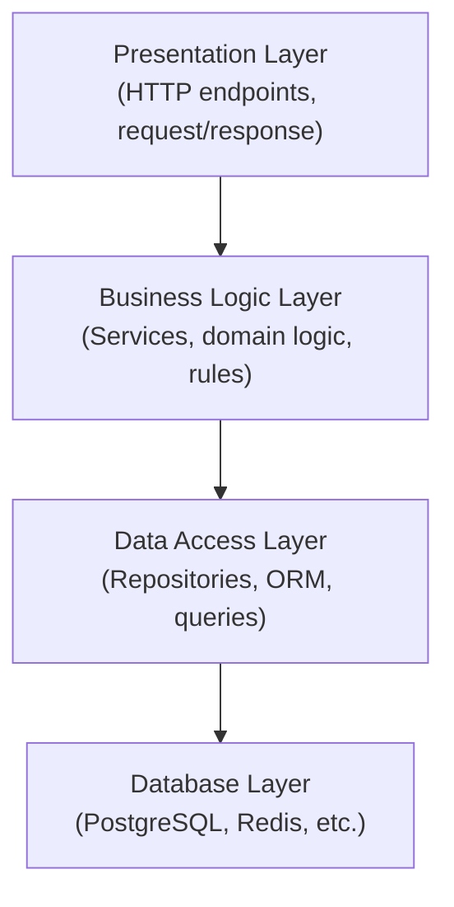
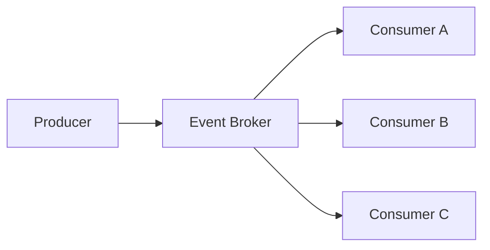

## 3.4 Architectural Patterns

Individual patterns solve problems within a class or a module. Architecture solves problems across an entire system — how components are divided, how they communicate, and how the system will respond when requirements change or load grows. Architectural decisions inherit the same principles (SRP, DIP, OCP) but apply them at a different scale: the "class" becomes a service, the "method" becomes an API endpoint, and the "dependency" becomes a network call.

An architectural pattern is a high-level strategy for organising the major components of a system. Selecting the right pattern is a decision that typically cannot be reversed without rewriting large portions of the codebase — and the wrong choice compounds every subsequent design decision built on top of it.

### 3.4.1 Layered (N-Tier) Architecture

The layered pattern organises a system into horizontal layers, where each layer serves the layer above it and depends only on the layer below it ([Buschmann et al., 1996](https://www.wiley.com/en-us/Pattern+Oriented+Software+Architecture%2C+Volume+1%2C+A+System+of+Patterns-p-9780471958697)).

**Strengths:** Simple to understand; good separation of concerns; easy to test each layer independently.

**Weaknesses:** Can lead to "pass-through" layers that add no logic; performance overhead from passing data through many layers; tendency toward monolithic deployment.

**Suitable for:** Business applications, CRUD-heavy APIs, systems where the team is primarily familiar with this pattern.

### 3.4.2 Model-View-Controller (MVC)

MVC separates a system into three components ([Reenskaug, 1979](https://folk.universitetetioslo.no/trygver/themes/mvc/mvc-index.html)):

- **Model**: The data and business logic
- **View**: The presentation layer (what the user sees)
- **Controller**: Handles user input and coordinates Model and View

MVC is widely used in web frameworks: Django, Ruby on Rails, and Spring MVC all implement variants of this pattern.

### 3.4.3 Event-Driven Architecture

In an event-driven architecture, components communicate by producing and consuming events rather than calling each other directly. An *event broker* (such as Apache Kafka or RabbitMQ) decouples producers from consumers.

**Strengths:** High decoupling; components can scale independently; easy to add new consumers without modifying producers.

**Weaknesses:** Harder to reason about system state; distributed tracing is complex; eventual consistency requires careful handling.

**Suitable for:** High-throughput systems, microservices that need loose coupling, real-time notification systems, audit log pipelines.

### 3.4.4 Microservices

A microservices architecture decomposes a system into small, independently deployable services, each responsible for a single bounded domain ([Newman, 2015](https://www.oreilly.com/library/view/building-microservices/9781491950340/)). Each service has its own database and communicates with others via APIs or events.

**Strengths:** Services can be deployed, scaled, and rewritten independently; teams can work autonomously on separate services; fault isolation.

**Weaknesses:** Significant operational complexity (service discovery, distributed tracing, network latency, eventual consistency); not appropriate for small teams or early-stage products.

**Suitable for:** Large teams (multiple squads, each owning a service); systems where different components have very different scaling requirements.

### 3.4.5 Monolithic Architecture

A monolith is a single deployable unit containing all the system's functionality. Despite its reputation, a well-structured monolith is often the right choice for small teams and early-stage systems ([Fowler, 2015](https://martinfowler.com/bliki/MonolithFirst.html)).

**Strengths:** Simple to develop, test, and deploy; no network latency between components; easy to refactor across the codebase.

**Weaknesses:** Entire system must be redeployed for any change; scaling requires scaling the entire application; risk of components becoming tightly coupled over time.

**The "Monolith First" principle**: Start with a well-structured monolith. Extract services only when you have clear evidence that a specific component needs independent scaling or when team boundaries demand it.

---
