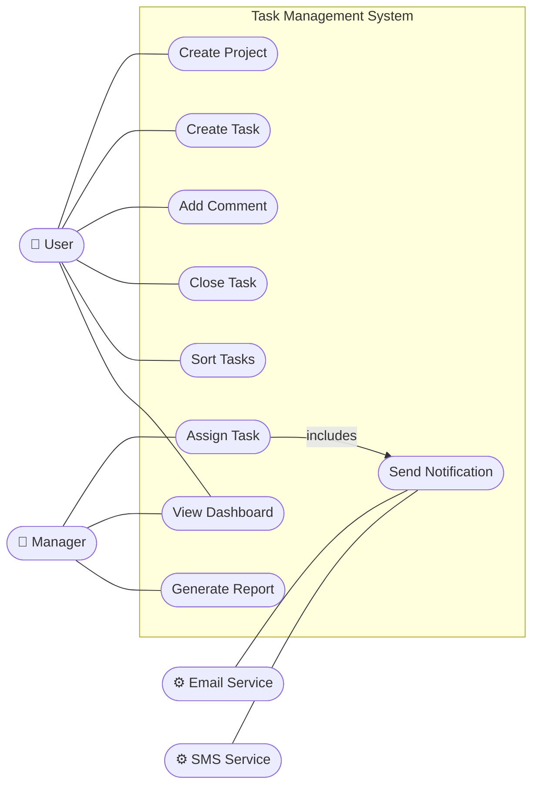
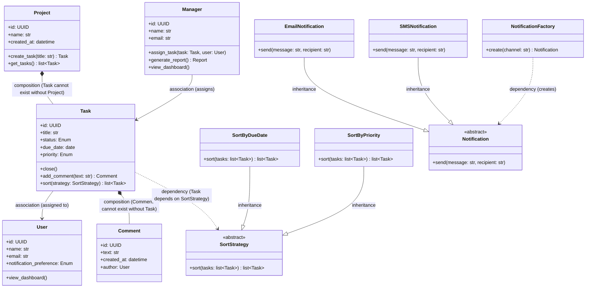
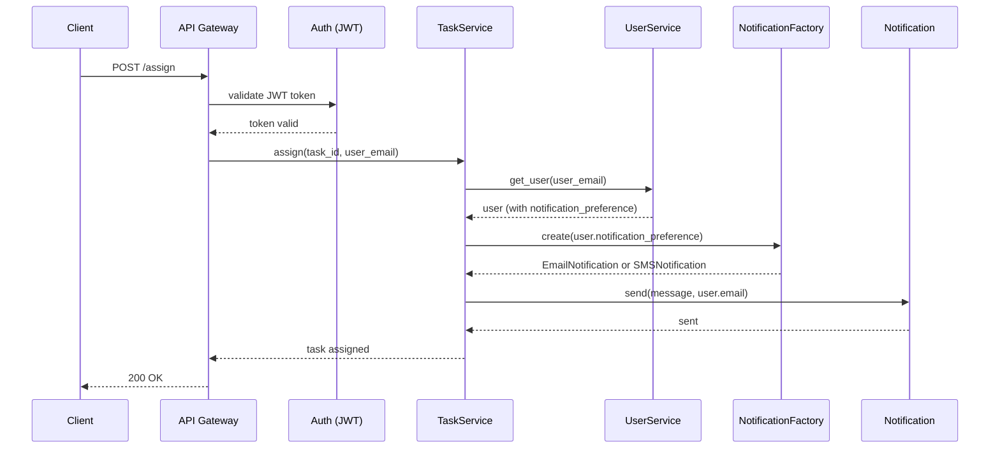
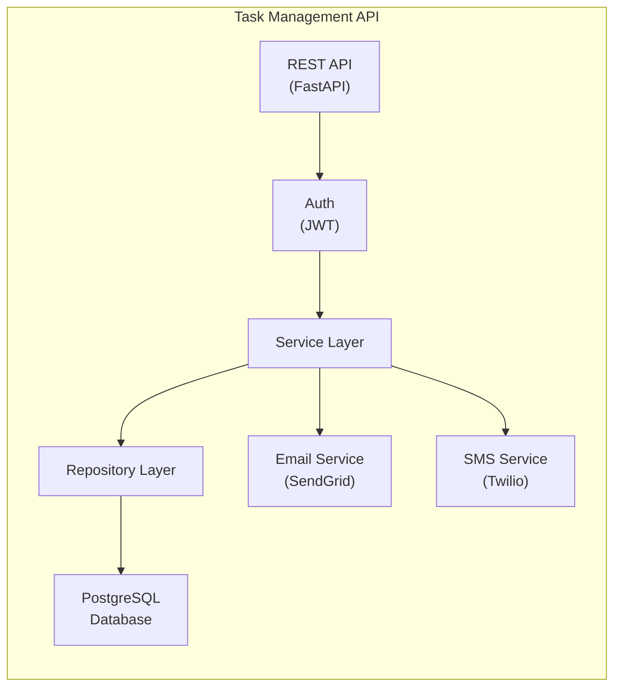

## 3.5 UML Diagrams

Once you have chosen the principles, patterns, and architecture for a system, you need a way to communicate those decisions to the rest of the team — across disciplines, across time zones, and across the months between the initial design and the eventual code review. The Unified Modeling Language (UML) provides that shared vocabulary ([OMG, 2017](https://www.omg.org/spec/UML/2.5.1/)). It is a standardised notation for visualising software systems, designed to be precise enough that two developers reading the same diagram reach the same understanding.

We focus on four diagram types that are most commonly used in practice. To make each diagram concrete and comparable, all four examples in this section are drawn from the same system — a project management tool whose requirements are described in the scenario below. Read the scenario once, then refer back to it as you study each diagram type.

**Example — Project Management Tool:**

**Scenario:** A project management tool has two human actors — a **User** and a **Manager** — and two external system actors — an **Email Service** (SendGrid) and an **SMS Service** (Twilio). The system is built as a REST API using FastAPI, stores data in a **PostgreSQL** database, and requires all requests to be authenticated via JWT tokens before reaching the service layer. Users can create projects, create tasks within those projects, add comments to tasks, close tasks, sort tasks by different strategies (due date or priority), and view a shared dashboard. Managers can assign tasks to users, view the dashboard, and generate reports. Whenever a manager assigns a task, the system looks up the recipient's notification preference and automatically sends a notification through either SendGrid or Twilio.

### 3.5.1 Use Case Diagrams

Use case diagrams show the interactions between *actors* (users or external systems) and the *use cases* (features) a system provides. They communicate system scope at a high level and are useful for stakeholder communication early in a project.

**Elements:**
- **Actor**: A stick figure representing a user role or external system
- **Use case**: An oval representing a system function
- **Association**: A line connecting an actor to the use cases they participate in
- **System boundary**: A rectangle enclosing all use cases in scope

**Example — Task Management System:**

The use case diagram below maps the scenario's four actors to the nine features they interact with. Notice how `Assign Task` includes `Send Notification` — capturing the rule that every assignment automatically triggers a notification.

Use case diagrams intentionally omit implementation detail — they show *what* the system does, not *how*.

### 3.5.2 Class Diagrams

Class diagrams show the static structure of a system — the classes, their attributes and methods, and the relationships between them. They are the most widely used UML diagram type for communicating object-oriented design.

**Key relationships:**
- **Association**: A uses B (solid line)
- **Aggregation**: A has B, B can exist without A (hollow diamond)
- **Composition**: A contains B, B cannot exist without A (filled diamond)
- **Inheritance**: A is a B (hollow triangle arrow)
- **Interface implementation**: A implements B (dashed line with hollow triangle)
- **Dependency**: A depends on B (dashed arrow)

The class diagram below models the scenario described above, showing how each relationship type appears in a real domain. Notice how composition is used where an entity cannot exist independently, aggregation where it can, and the Factory Method pattern is used to decouple notification creation from its concrete implementations.

### 3.5.3 Sequence Diagrams

Sequence diagrams show how objects interact over time to accomplish a specific use case. They are valuable for documenting the flow of a complex operation, particularly when multiple components or services are involved.

**Example — Assigning a task:**

The sequence diagram below traces the `Assign Task` use case end-to-end, showing how the API Gateway validates the JWT token, how `TaskService` delegates user lookup and notification creation to dedicated services, and how the Factory Method pattern selects the correct channel at runtime.

### 3.5.4 Component Diagrams

Component diagrams show the high-level organisation of a system into components and their dependencies. They bridge the gap between architecture diagrams and class diagrams.

**Example — Task Management API components:**

The component diagram below shows how the system is decomposed into deployable components. Notice that all requests pass through the Auth component before reaching the Service Layer, and that the Service Layer fans out to both the Email and SMS external services — reflecting the two notification channels described in the scenario.

---
