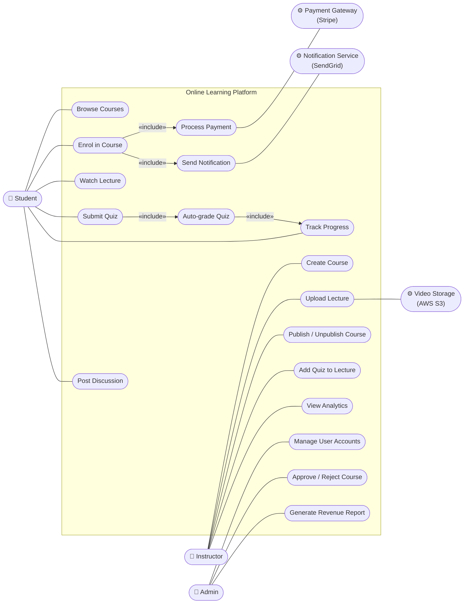
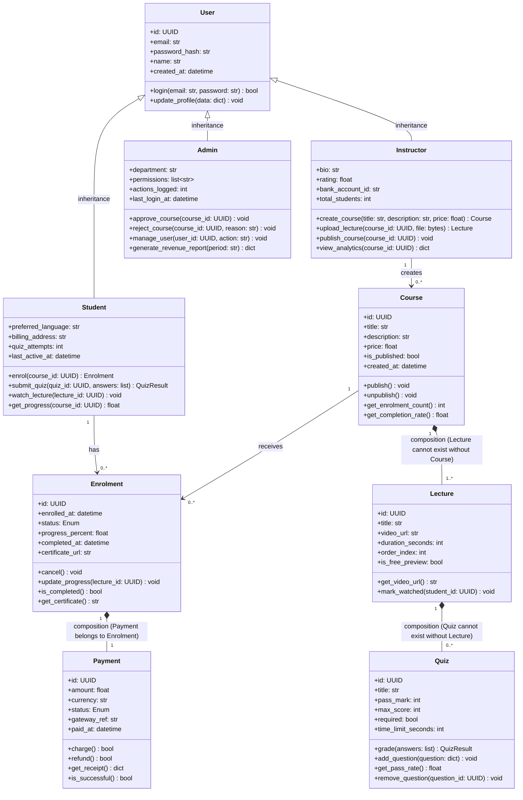
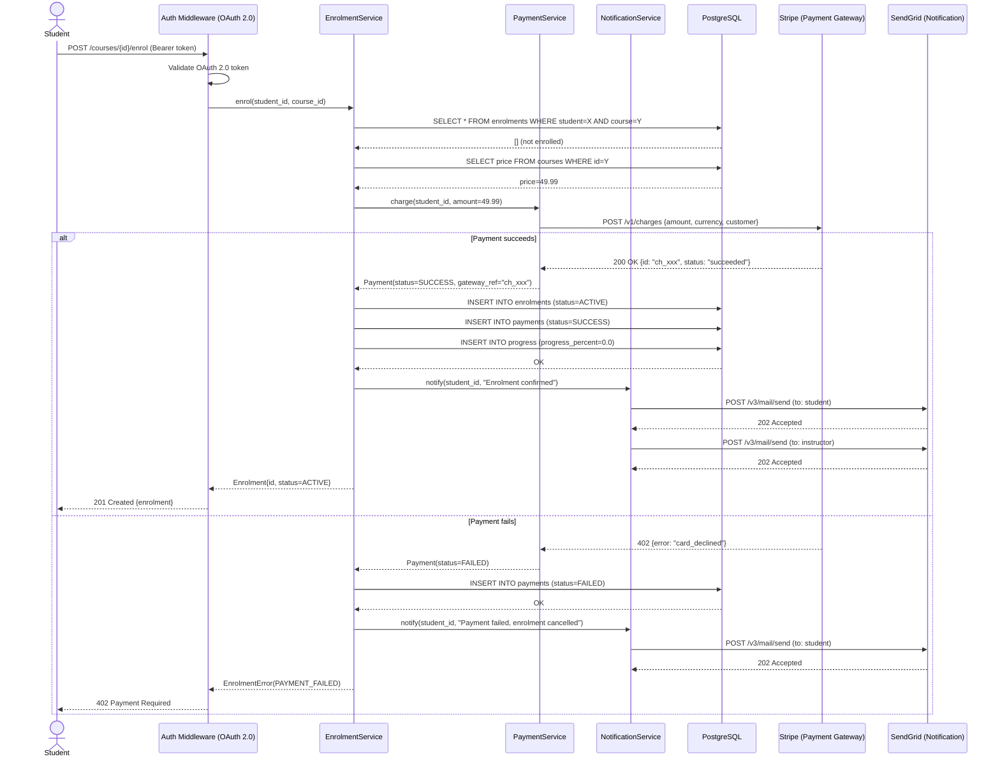
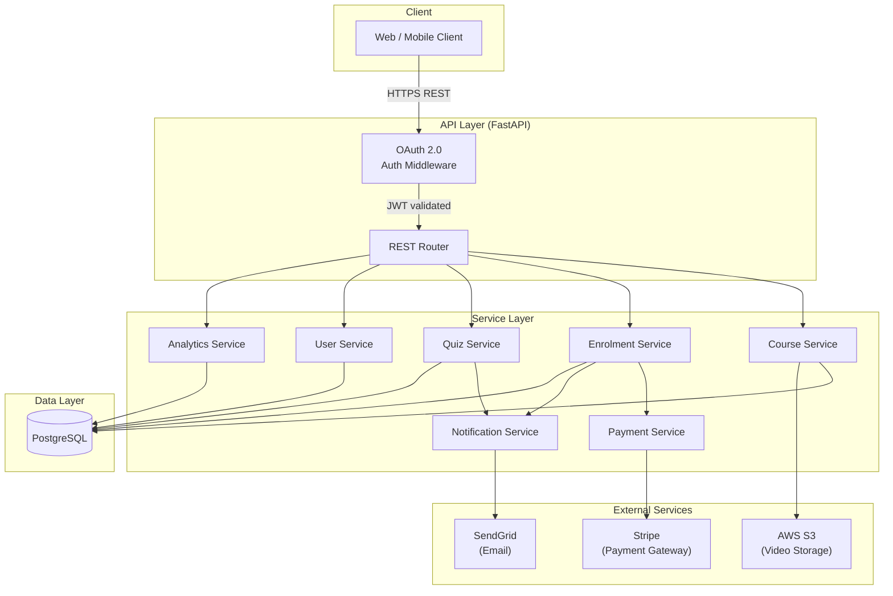

## 3.8 Tutorial: Designing a Learning Management System

Four design artefacts come out of this tutorial: an annotated diagnosis of a broken codebase, an argued architecture recommendation, four mutually consistent UML diagrams, and a refactored function with two revision passes. All four are grounded in a single online learning platform scenario with six actors and three external services. Decisions made in Part 1 constrain decisions made in Part 3 — inconsistencies surface and must be resolved. Every choice must be defensible against the scenario text.

**Concepts covered:** SOLID principles, GoF design patterns, architectural patterns, UML diagrams (use case, class, sequence, component), clean code refactoring

**Format:** Individual or pairs | **Duration:** ~2 hours | **Tool:** [draw.io](https://app.diagrams.net/) or [Mermaid](https://mermaid.js.org/), Python

---

### Outline

- [Part 1: Design Principles & Pattern Analysis](#part-1--design-principles--pattern-analysis-45-min)
- [Part 2: Architecture Decision](#part-2--architecture-decision-20-min)
- [Part 3: Diagram Creation](#part-3--diagram-creation-30-min)
- [Part 4: Clean Code Refactor](#part-4--clean-code-refactor-25-min)
- [References](#references)

---

### Learning Objectives

By the end of this tutorial, you will be able to:

1. Identify SOLID violations and clean code failures in existing code and label each by principle.
2. Select an architectural pattern for a given system scenario and defend the choice against alternatives.
3. Produce all four UML diagram types for a single domain and verify they are mutually consistent.
4. Refactor a cryptically named function through two passes: rename for clarity, then restructure for readability.

---

### Part 1 — Design Principles & Pattern Analysis *(~45 min)*

Before deciding how to structure the system at large, we need to evaluate the code-level design. This part applies the principles from Section 3.2 and the patterns from Section 3.3 to a broken codebase taken from an early prototype of the platform. The problems you find here will directly motivate the structural decisions in Parts 2 and 3.

#### Step 1: Diagnose the Codebase *(~30 min)*

The following code is taken from a broken codebase. Read it carefully and annotate every problem you find, labelling each one with the relevant principle or pattern name from Sections 3.2 and 3.3.

```python
# task_service.py
import smtplib
import psycopg2


class TaskService:
    def __init__(self):
        self.conn = psycopg2.connect("host=localhost dbname=tasks")    # (?)

    def process(self, t, f, uid):                                      # (?)
        if t == "" or t == None:                                       # (?)
            print("bad title")
            return None
        cur = self.conn.cursor()
        cur.execute(f"INSERT INTO tasks VALUES ('{t}', '{uid}')")      # (?)
        self.conn.commit()
        smtp = smtplib.SMTP('smtp.gmail.com')                          # (?)
        smtp.sendmail('app@co.com', uid, f'Task {t} created')
        if f == True:                                                  # (?)
            cur.execute(f"SELECT * FROM tasks WHERE uid='{uid}'")
            return cur.fetchall()
        return {"title": t, "user": uid}

    def process(self, tasks, reverse):                                 # (?)
        if reverse == True:
            return sorted(tasks, key=lambda x: x['date'], reverse=True)
        else:
            return sorted(tasks, key=lambda x: x['date'])
```

Replace each `(?)` marker with the name of the violation (e.g., *SRP violation*, *DIP violation*, *poor naming*).

<details>
<summary>Click to reveal sample answer.</summary>

| Marker | Violation |
|---|---|
| Line 7 | DIP — `TaskService` directly instantiates a concrete `psycopg2` connection rather than accepting an injected abstraction |
| Line 10 | Clean Code / naming — `process`, `t`, `f`, `uid` reveal no intent |
| Line 11 | Clean Code — `t == None` should be `t is None`; the empty-string check is a separate concern |
| Lines 13–14 | Security — SQL injection via f-string interpolation |
| Lines 15–16 | SRP — email sending belongs in a dedicated notification service, not in `TaskService` |
| Line 17 | Clean Code — `if f == True` should be `if f` |
| Lines 20–23 | OCP + Strategy — sorting logic is hardcoded; new sort orders require modifying this class. Also, the duplicate method name silently shadows the first `process` method |

</details>

#### Step 2: Activity — Fix the Service *(~15 min)*

Rewrite `__init__` and the first `process` method to fix the DIP, SRP, and naming violations. You do not need a full working implementation — correct method signatures, type annotations, and injected dependencies are sufficient.

Share your rewrite with another pair. Check that theirs separates the database concern from the notification concern and accepts only abstract interfaces in `__init__`.

---

### Part 2 — Architecture Decision *(~20 min)*

Code-level design sets the floor; architecture sets the ceiling. Good architectural choices amplify the SOLID principles from Part 1: a layered boundary enforces SRP between services; an event-driven broker enforces DIP between producers and consumers. Poor choices make those principles impossible to apply regardless of how clean the code inside each service is.

#### Step 1: Argue the Architecture

Read each scenario below and select the most appropriate architectural pattern from Section 3.4. Write a two-sentence justification for your choice.

| Scenario | System description |
|---|---|
| **A** | A 2-person startup building a task management MVP with a 3-month deadline and no existing infrastructure. |
| **B** | A 500-person enterprise replacing a legacy task tracking platform, with 8 independent product teams each owning a separate domain. |
| **C** | A real-time task notification system that must process 100,000 events per minute and fan out to email, SMS, and audit log consumers. |

> **Hint:** There is no single correct answer for every scenario, but some choices are much harder to defend than others.

<details>
<summary>Click to reveal sample answer.</summary>

**Scenario A → Monolith**
Small team, tight deadline, no existing infrastructure. A monolith is simple to develop, test, and deploy in a single step. Microservices or event-driven would introduce operational complexity — service discovery, distributed tracing, network latency — that a 2-person team cannot absorb. Apply the "Monolith First" principle from Section 3.4.5.

**Scenario B → Microservices**
Eight independent teams each owning a separate domain maps directly to the microservices model: each team deploys their service independently, owns its database, and cannot break other teams' releases. The significant operational overhead is justified because the organisational structure demands it (Section 3.4.4).

**Scenario C → Event-Driven Architecture**
High-throughput fan-out to multiple consumers (email, SMS, audit log) is the textbook event-driven use case. Producers publish to a broker; each consumer subscribes and scales independently. Synchronous direct calls at 100,000 events/minute would create tight coupling and bottlenecks (Section 3.4.3).

**Defensible alternatives:**
- Scenario A: Layered/MVC is also acceptable — it is a structured monolith. The key argument to reject is microservices.
- Scenario B: A layered monolith can be defended if teams are co-located and domains are not truly independent, but it is the harder argument.
- Scenario C: Microservices with synchronous APIs would require queueing infrastructure to handle this throughput — which is effectively event-driven anyway.

</details>

#### Step 2: Activity — Defend Your Choice

Present your three justifications to another group. Where your choices differ, each side must argue from the specific strengths and weaknesses in Section 3.4 — not from intuition. A justification that cannot cite a concrete section trade-off is not a justification.

---

### Part 3 — Diagram Creation *(~30 min)*

Principles, patterns, and architecture only matter if the team shares the same mental model — and teams rarely do until they draw it. Diagrams are the artefacts that surface disagreements before they become bugs. Draw all four UML diagram types covered in Section 3.5. Each diagram must be consistent with the others — the same actors, classes, and components should appear across all four, and the architectural decisions from Part 2 should be visible in the component diagram.

---

### Scenario — Online Learning Platform

All four steps of this Part 3 are grounded in the same system. Read it once before beginning Step 1, then refer back as needed.

An online learning platform has three human actors — a **Student**, an **Instructor**, and an **Admin** — and three external system actors — a **Payment Gateway** (Stripe), a **Video Storage Service** (AWS S3), and a **Notification Service** (SendGrid). The system is built as a REST API using FastAPI, stores data in a PostgreSQL database, and requires all requests to be authenticated via OAuth 2.0 tokens before reaching the service layer.

Instructors can create courses, upload video lectures to AWS S3, publish or unpublish courses, add quizzes to lectures, and view an analytics dashboard showing enrolment and completion rates. Students can browse published courses, enrol in a course by paying through Stripe, watch lectures, submit quiz answers, track their progress, and post questions in a course discussion thread. Admins can manage user accounts, approve or reject courses submitted for review, and generate platform-wide revenue reports.

Whenever a student enrols in a course, the system charges the student via Stripe and — if payment succeeds — sends a confirmation notification through SendGrid. If payment fails, the enrolment is cancelled and the student is notified. Instructors are also notified via SendGrid whenever a student enrols in one of their courses. Quiz submissions are automatically graded; students receive their result immediately and their progress record is updated. Course progress is calculated as the percentage of lectures watched and quizzes passed.

A student who enrols, fails a payment, retries, watches three lectures, submits a quiz, and posts a question has touched all six actors and all three external services. That single journey is the thread running through every diagram you will draw in Part 3.

---

#### Step 1: Use Case Diagram

Draw a use case diagram showing all actors, all use cases within the system boundary, and at least two `<<include>>` or `<<extend>>` relationships. Justify each relationship in one sentence.

#### Step 2: Class Diagram

Draw a class diagram for the core domain. Include at least: `Course`, `Lecture`, `Quiz`, `Enrolment`, `Student`, `Instructor`, `Admin`, `Payment`. Show correct relationship types (composition, aggregation, association, inheritance, dependency) with multiplicity on each end. Add at least four attributes and two methods to each class.

#### Step 3: Sequence Diagram

Draw a sequence diagram for the **Enrol in Course** use case, tracing the full flow from the student's HTTP request through payment, notification, and progress initialisation.

#### Step 4: Component Diagram

Draw a component diagram showing all internal components and their dependencies, including the three external services. Show the auth layer explicitly.

#### Step 5: Activity — Verify Consistency

Check that the participants in your sequence diagram match classes in your class diagram, and that the components in your component diagram correspond to the layers implied by your class diagram. List every inconsistency you find and explain in one sentence how you would resolve it. Compare your list with another pair.

<details>
<summary>Click to reveal sample answer.</summary>

**Diagram 1 — Use Case Diagram**

> Mermaid has no native use-case diagram type; the flowchart below encodes the same information using rounded shapes for actors, rectangles for use cases inside the system boundary, and labelled arrows for `«include»` relationships.



**Relationship justifications:**
- `Enrol in Course` **«include»** `Process Payment`: every enrolment unconditionally triggers a Stripe charge — payment is mandatory, not optional.
- `Enrol in Course` **«include»** `Send Notification`: on every enrolment outcome (success or failure) a SendGrid email is sent — notification is part of the enrolment contract.
- `Submit Quiz` **«include»** `Auto-grade Quiz`: every quiz submission unconditionally triggers automatic grading — students always receive their result immediately.
- `Auto-grade Quiz` **«include»** `Track Progress`: every graded quiz unconditionally updates the student's progress percentage — progress is always recalculated after a quiz result.

---

**Diagram 2 — Class Diagram**



---

**Diagram 3 — Sequence Diagram: Enrol in Course**



---

**Diagram 4 — Component Diagram**



---

</details>

---

### Part 4 — Clean Code Refactor *(~25 min)*

Diagrams communicate structure at the level of components and relationships. Clean code does the same for the reader of a single function — but the unit is a name, not a box, and the feedback is the next person's confusion, not a failing build. This part applies the naming and readability practices from Section 3.6 to a function extracted from an early version of the platform's enrolment service.

#### Step 1: Round 1 — Rename Only *(~10 min)*

The following function was extracted from an early prototype. Enrolment records were stored as tuples: `(id, course_id, status, deadline)`, where `status == 1` means active. The function filters which enrolments a student can see.

```python
def proc(d, f, x):
    r = []
    for i in d:
        if i[2] == 1:
            if f:
                r.append(i)
            elif i[3] <= x:
                r.append(i)
    return r
```

- Give the function and all parameters meaningful names
- Add type annotations to the signature
- Add one comment where it is genuinely needed (explain *why*, not *what*)
- Do not change any logic

#### Step 2: Round 2 — Restructure *(~15 min)*

- Flatten the nested `if` statements
- Replace the loop with a list comprehension if it improves clarity
- Extract any implicit concept (e.g., the condition `i[2] == 1`) into a named variable or helper

#### Step 3: Activity — Cross-Review

Swap your Round 2 refactor with another pair. Read their function signature only — not the body. Write down what you think the function does. Then read the body and check your prediction. If you were wrong, identify which name misled you and propose a better one.

---

### References

- [draw.io](https://app.diagrams.net/) — Browser-based diagramming tool for UML diagrams; no installation required
- [Mermaid Documentation](https://mermaid.js.org/) — Diagram-as-code tool used for all diagrams in Chapter 3; renders in GitHub and mdBook
- [UML 2.5.1 Specification](https://www.omg.org/spec/UML/2.5.1/) — OMG's authoritative reference for all UML diagram types and notation
- [SOLID Principles (Robert C. Martin)](https://web.archive.org/web/20150906155800/http://www.objectmentor.com/resources/articles/Principles_and_Patterns.pdf) — Original article defining the five SOLID principles
- [Clean Code (Martin, 2008)](https://www.oreilly.com/library/view/clean-code-a/9780136083238/) — Source for the naming, function, and comment conventions applied in Part 4
- [Refactoring Guru](https://refactoring.guru/) — Illustrated catalog of all 23 GoF design patterns and common refactoring techniques, with Python examples
