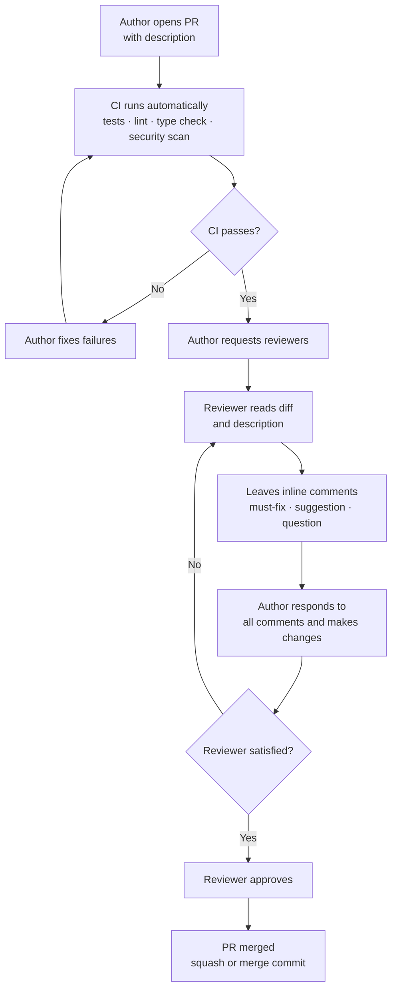

# Chapter 5: Automated Code Review, Code Quality, and CI/CD

---

## 5.1 What Is Code Review?

Code review is the practice of having one or more developers read and evaluate a change to the codebase before it is merged. Its primary goals are defect detection, knowledge sharing, and enforcing standards — and it is among the most effective quality practices known in software engineering ([Fagan, 1976](https://ieeexplore.ieee.org/document/5388086); [Rigby & Bird, 2013](https://dl.acm.org/doi/10.1145/2491411.2491444)).

### 5.1.1 Fagan Inspection

The formal origin of code review is the *Fagan inspection*, introduced by Michael Fagan at IBM in 1976. A Fagan inspection is a structured, meeting-based process with defined roles:

- **Author**: the developer who wrote the code
- **Moderator**: facilitates the meeting and keeps it on track
- **Reader**: reads the code aloud, paraphrasing to expose gaps in understanding
- **Reviewers**: evaluate the code against a checklist and raise defects

Fagan found that inspections caught 60–90% of defects before testing — a rate that testing alone rarely matches. The key insight was that a *structured* process with defined roles and an explicit checklist performs better than ad-hoc reading.

### 5.1.2 Code Review Checklist

Modern teams rarely run formal Fagan inspections, but the checklist principle survives. A reviewer should systematically ask:

| Category | Questions |
|---|---|
| **Correctness** | Does the code do what the description claims? Are edge cases handled? |
| **Tests** | Are there sufficient tests? Do they cover the happy path and failure cases? |
| **Design** | Does the change fit the existing architecture? Does it introduce unnecessary coupling? |
| **Readability** | Can you understand the code without asking the author? Are names clear? |
| **Security** | Does the change introduce injection risks, broken auth, or unsafe defaults? |
| **Performance** | Are there N+1 queries, unbounded loops, or unnecessary allocations? |
| **Error handling** | Are errors caught and surfaced appropriately? Are resources released on failure? |
| **Documentation** | Are public interfaces documented? Do comments explain *why*, not *what*? |

Reviewers are not responsible for finding every bug — that is what tests are for. The goal is a second pair of eyes that catches what the author's familiarity with their own code conceals.

---

## 5.2 Modern Code Review: Pull Requests

Contemporary code review is conducted through *pull requests* (PRs), also called *merge requests* on GitLab ([Gousios et al., 2014](https://doi.org/10.1145/2568225.2568260)). A pull request is a request to merge a set of commits from one branch into another — typically from a feature branch into `main`. It replaces the synchronous meeting of Fagan inspection with an asynchronous, tool-mediated process.

A PR serves as a structured checkpoint that combines:

- **Change visibility**: a diff showing exactly what changed and why
- **Discussion space**: a thread where reviewers can ask questions, raise concerns, and suggest improvements
- **Automated gate**: a trigger for CI checks (tests, linting, type checking, security scans) that must pass before merging
- **Audit trail**: a permanent record of what was changed, who reviewed it, and what was discussed

### 5.2.1 The Review Process

A standard PR lifecycle proceeds as follows:



**Step 1 — Author opens PR with description.** The author pushes the feature branch and opens a pull request against `main`. The description explains what changed, why, and how to test it (see Section 5.2.2). A clear description sets reviewers up to evaluate the change in context rather than reconstruct intent from the diff alone.

**Step 2 — CI runs automatically.** Opening the PR triggers the CI pipeline immediately, before any human sees the code. The pipeline runs linting, type checking, tests, and security scans in parallel. This automated pre-filter ensures that reviewers spend their attention on logic and design, not on mechanical errors a tool could have caught.

**Step 3 — CI passes?** If the pipeline fails, the author fixes the failures and pushes new commits. The pipeline re-runs on each push. The PR cannot proceed to human review while CI is red — this is enforced by branch protection rules that block merging until all required checks pass.

**Step 4 — Author requests reviewers.** Once CI is green, the author assigns one or more reviewers. Reviewer selection matters: reviewers should be familiar with the affected area of the codebase ([Rigby & Bird, 2013](https://dl.acm.org/doi/10.1145/2491411.2491444); [Thongtanunam et al., 2015](https://ieeexplore.ieee.org/document/7081824/)). On most teams, one approval is sufficient for routine changes; two are required for changes to core infrastructure, security-sensitive code, or public APIs.

**Step 5 — Reviewer reads the diff and description.** The reviewer reads the PR description first to understand intent, then reads the diff. A good reviewer uses the checklist from Section 5.1.2 as a mental framework, checking correctness, tests, design, readability, security, and performance in turn.

**Step 6 — Reviewer leaves inline comments.** Comments are placed directly on the relevant lines of the diff. Each comment is tagged to indicate its weight: a `[must]` comment blocks approval and requires a fix; a `[nit]` is a non-blocking suggestion; a `[question]` requests clarification without implying a problem. Tagging prevents ambiguity about what the author is required to address.

**Step 7 — Author responds and makes changes.** The author addresses every comment — fixing defects, pushing revised commits, and replying to each thread. Replies should acknowledge the feedback explicitly: *"fixed in latest commit"* or *"kept as-is because X"*. Unresolved threads signal to the reviewer that the review cycle is not yet complete.

**Step 8 — Reviewer satisfied?** The reviewer checks whether all must-fix comments have been resolved and evaluates the new commits. If outstanding issues remain, the reviewer adds further comments and the author addresses them in another iteration. Each iteration narrows the gap between the submitted code and the standard required for approval.

**Step 9 — Reviewer approves.** When the reviewer is satisfied, they record a formal approval. Approval means the code is good enough to ship — not necessarily perfect. Over-holding a PR for perfection increases cost without proportionate quality gain.

**Step 10 — PR merged.** The author (or a designated maintainer) merges the branch into `main`. Most teams use either a *squash merge* — collapsing all PR commits into one — or a *merge commit* that preserves the full history. Squash merges keep the main branch history linear and easy to bisect; merge commits preserve the granular development history of the feature.

### 5.2.2 Writing an Effective Pull Request

A good PR is small, focused, and self-explanatory. **Keep PRs small.** A PR touching 10 files is reviewed carefully; a PR touching 50 files is rubber-stamped. Aim for changes that can be reviewed in under 20 minutes. If a feature requires large changes, break it into sequential PRs: data model first, then business logic, then API layer.

The title and description should answer three questions:

1. **What changed?** — a one-line summary that a reader can understand without opening the diff
2. **Why?** — the motivation: the bug being fixed, the requirement being met, the tech debt being addressed
3. **How should reviewers test it?** — the steps to verify the change works as intended

```markdown
## What
Add pagination to the task list endpoint (`GET /tasks`).

## Why
The endpoint currently returns all tasks in a single response. With >10,000 tasks
in staging, response times exceed 5 s and memory usage spikes. Fixes #142.

## How to test
1. Run `pytest tests/test_task_endpoint.py -k pagination`
2. Manually: `curl "localhost:8000/tasks?page=2&page_size=20"` — should return
   tasks 21–40 with `X-Total-Count` header set correctly.
3. Edge case: `page=0` should return HTTP 422.
```

### 5.2.3 Review Etiquette

Effective code review requires clear, respectful communication on both sides.

**For reviewers:**
- Review the code, not the person — *"This function is hard to follow"* not *"You wrote this poorly"*
- Be specific and actionable — vague comments waste everyone's time
- Acknowledge what is done well — a review that is only criticism is demoralising
- Distinguish blocking issues from suggestions with explicit prefixes (`[must]`, `[nit]`, `[question]`)

**For authors:**
- Do not take feedback personally — the reviewer is evaluating the code, not your ability
- Explain your reasoning when you disagree rather than silently reverting or silently keeping your version
- Keep the PR small enough that reviewers can engage thoroughly
- Respond to all comments before requesting re-review

---

## 5.3 Limitations of Manual Code Review

Code review is effective but not free. Understanding its costs helps teams apply it well rather than applying it uniformly.

**Time and cognitive load.** A careful review of 400 lines takes a skilled engineer 45–60 minutes. At scale, review becomes a significant fraction of total engineering time. Teams that treat review as a low-priority interrupt find that PRs sit unreviewed for days, blocking delivery.

**Inconsistency.** Human reviewers vary in thoroughness, focus, and knowledge. The same code reviewed by two different engineers will produce different feedback. Style and convention issues — the easiest mechanical problems to fix — consume disproportionate reviewer attention.

**Fatigue effects.** Research on inspection data finds that defect detection rate drops significantly after the first hour of review ([Capers Jones, 1991](https://dl.acm.org/doi/10.5555/573262)). Large PRs exploit this effect: reviewers find early defects carefully and then accelerate through the rest.

**Coverage gaps.** Manual review catches design and logic problems well but is unreliable for performance, security, and concurrency bugs, which require systematic analysis rather than reading. A reviewer who does not think to check for SQL injection will not find it.

Manual review should therefore focus on what humans do best — evaluating design decisions, business logic, and domain correctness — while mechanical checks are delegated to automated tools.

---

## 5.4 Automated Code Review Using Static Analysis

Automated code review tools analyse source code without executing it, systematically checking for a class of issues that manual review catches inconsistently. They are fast, cheap, and consistent — running in seconds on every commit with no reviewer fatigue.

Tools are most effective at:
- Enforcing style and formatting rules uniformly
- Catching type errors before runtime
- Identifying known security anti-patterns
- Flagging unused imports, dead code, and obvious bugs

They are least effective at:
- Understanding business context and domain logic
- Evaluating architectural decisions
- Catching subtle security vulnerabilities that require contextual reasoning
- Judging whether a change is the *right* change to make

The practical pattern is to run automated analysis as a *pre-filter* before human review: CI blocks the PR if automated checks fail, so reviewers can focus their attention on what tools cannot catch.

---

## 5.5 Code Quality Analysis

### 5.5.1 Linting and Formatting with Ruff

Ruff ([Astral, 2023](https://docs.astral.sh/ruff/)) is a fast Python linter and formatter written in Rust. It enforces style rules and catches common programming errors:

```bash
ruff check src/       # lint
ruff format src/      # format (replaces black)
```

Ruff subsumes the functionality of flake8, isort, and black, and runs 10–100× faster than any of them individually. A typical configuration in `pyproject.toml`:

```toml
[tool.ruff]
line-length = 88
target-version = "py311"

[tool.ruff.lint]
select = ["E", "F", "I", "N", "UP"]   # pycodestyle, pyflakes, isort, naming, pyupgrade
ignore = ["E501"]                       # handled by formatter
```

Running `ruff check --fix src/` applies safe auto-fixes — removing unused imports, reordering them, upgrading deprecated syntax — without changing behaviour.

### 5.5.2 Type Checking with mypy

Type annotations in Python (since PEP 484, [van Rossum et al., 2015](https://peps.python.org/pep-0484/)) enable static analysis. mypy verifies that annotations are consistent throughout the codebase, catching a class of bugs that tests can miss:

```bash
mypy src/ --strict
```

Common errors mypy catches:
- Passing `None` where a non-optional value is expected
- Calling a method that does not exist on a type
- Returning the wrong type from a function
- Missing return statements in non-`None` functions

Example: the following code passes all unit tests but fails mypy because `divide` can return `None` yet the caller treats the result as `float`:

```python
def divide(a: float, b: float) -> float:
    if b == 0:
        return None        # mypy: error: Incompatible return value type
    return a / b

result: float = divide(10, 0)
print(result + 1)          # AttributeError at runtime
```

Fixing the annotation to `Optional[float]` forces every caller to handle the `None` case explicitly, eliminating the runtime error before deployment.

> **Box: Incremental adoption of mypy**
>
> Adding `--strict` to an existing codebase typically produces hundreds of errors. A practical adoption path is incremental: start with `mypy src/ --ignore-missing-imports` and fix errors module by module, adding `# type: ignore` sparingly for cases that require deeper refactoring. Once the baseline is clean, tighten the flags progressively toward `--strict`.

---

## 5.6 CI/CD and Quality Gate Checks

Continuous integration (CI) is the practice of merging all developer branches into the main branch frequently — at least daily — with each merge triggering an automated build and test run ([Fowler, 2006](https://martinfowler.com/articles/continuousIntegration.html)). Continuous delivery (CD) extends CI to ensure the software is always in a deployable state.

A *quality gate* is a CI step that fails the pipeline if a quality threshold is not met — coverage below 80%, any linting error, any type error, any medium-severity security finding. Quality gates convert code quality from a guideline into an enforced constraint.

### 5.6.1 GitLab CI Configuration

GitLab CI is configured through a `.gitlab-ci.yml` file at the repository root. Pipelines are composed of *jobs* grouped into *stages*; jobs within a stage run in parallel, and stages run sequentially.

```yaml
# .gitlab-ci.yml
image: python:3.11-slim

variables:
  PIP_CACHE_DIR: "$CI_PROJECT_DIR/.cache/pip"

cache:
  paths:
    - .cache/pip

stages:
  - lint
  - test
  - security

before_script:
  - pip install -r requirements.txt
```

The `before_script` block runs before every job, installing dependencies. The `cache` block persists the pip download cache across pipeline runs, reducing install time.

### 5.6.2 Multi-Stage Pipeline

Splitting the pipeline into stages makes failures fast and legible: a lint failure in stage 1 blocks the expensive test stage from running, giving the author immediate feedback at minimum cost.

```yaml
# Stage 1: lint
ruff:
  stage: lint
  script:
    - ruff check src/ tests/
    - ruff format --check src/ tests/

mypy:
  stage: lint
  script:
    - mypy src/ --strict

# Stage 2: test
unit-tests:
  stage: test
  script:
    - pytest tests/unit/ --cov=src --cov-report=xml --cov-fail-under=80
  coverage: '/TOTAL.*\s+(\d+%)$/'
  artifacts:
    reports:
      coverage_report:
        coverage_format: cobertura
        path: coverage.xml

integration-tests:
  stage: test
  script:
    - pytest tests/integration/ -v
  allow_failure: false

# Stage 3: security
bandit:
  stage: security
  script:
    - pip install bandit
    - bandit -r src/ -ll
  allow_failure: false
```

**Key configuration details:**

- `coverage:` is a regex that extracts the coverage percentage from pytest output; GitLab displays it on the pipeline page and merge request
- `artifacts: reports: coverage_report:` uploads the Cobertura XML so GitLab renders inline coverage annotations on the diff
- `allow_failure: false` (the default) means a failing job fails the entire pipeline and blocks merge
- Jobs within a stage (`unit-tests` and `integration-tests`) run in parallel automatically
