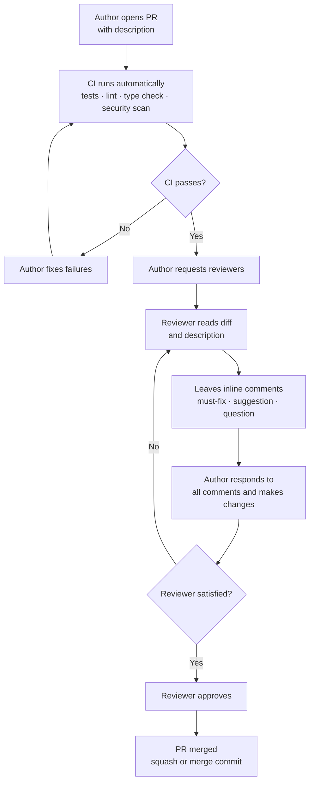

## 5.2 Modern Code Review: Pull Requests

Contemporary code review is conducted through *pull requests* (PRs), also called *merge requests* on GitLab ([Gousios et al., 2014](https://doi.org/10.1145/2568225.2568260)). A pull request is a request to merge a set of commits from one branch into another — typically from a feature branch into `main`. It replaces the synchronous meeting of Fagan inspection with an asynchronous, tool-mediated process.

A PR serves as a structured checkpoint that combines:

- **Change visibility**: a diff showing exactly what changed and why
- **Discussion space**: a thread where reviewers can ask questions, raise concerns, and suggest improvements
- **Automated gate**: a trigger for CI checks (tests, linting, type checking, security scans) that must pass before merging
- **Audit trail**: a permanent record of what was changed, who reviewed it, and what was discussed

### 5.2.1 The Review Process

A standard PR lifecycle proceeds as follows:



**Step 1 — Author opens PR with description.** The author pushes the feature branch and opens a pull request against `main`. The description explains what changed, why, and how to test it (see Section 5.2.2). A clear description sets reviewers up to evaluate the change in context rather than reconstruct intent from the diff alone.

**Step 2 — CI runs automatically.** Opening the PR triggers the CI pipeline immediately, before any human sees the code. The pipeline runs linting, type checking, tests, and security scans in parallel. This automated pre-filter ensures that reviewers spend their attention on logic and design, not on mechanical errors a tool could have caught.

**Step 3 — CI passes?** If the pipeline fails, the author fixes the failures and pushes new commits. The pipeline re-runs on each push. The PR cannot proceed to human review while CI is red — this is enforced by branch protection rules that block merging until all required checks pass.

**Step 4 — Author requests reviewers.** Once CI is green, the author assigns one or more reviewers. Reviewer selection matters: reviewers should be familiar with the affected area of the codebase ([Rigby & Bird, 2013](https://dl.acm.org/doi/10.1145/2491411.2491444); [Thongtanunam et al., 2015](https://ieeexplore.ieee.org/document/7081824/)). On most teams, one approval is sufficient for routine changes; two are required for changes to core infrastructure, security-sensitive code, or public APIs.

**Step 5 — Reviewer reads the diff and description.** The reviewer reads the PR description first to understand intent, then reads the diff. A good reviewer uses the checklist from Section 5.1.2 as a mental framework, checking correctness, tests, design, readability, security, and performance in turn.

**Step 6 — Reviewer leaves inline comments.** Comments are placed directly on the relevant lines of the diff. Each comment is tagged to indicate its weight: a `[must]` comment blocks approval and requires a fix; a `[nit]` is a non-blocking suggestion; a `[question]` requests clarification without implying a problem. Tagging prevents ambiguity about what the author is required to address.

**Step 7 — Author responds and makes changes.** The author addresses every comment — fixing defects, pushing revised commits, and replying to each thread. Replies should acknowledge the feedback explicitly: *"fixed in latest commit"* or *"kept as-is because X"*. Unresolved threads signal to the reviewer that the review cycle is not yet complete.

**Step 8 — Reviewer satisfied?** The reviewer checks whether all must-fix comments have been resolved and evaluates the new commits. If outstanding issues remain, the reviewer adds further comments and the author addresses them in another iteration. Each iteration narrows the gap between the submitted code and the standard required for approval.

**Step 9 — Reviewer approves.** When the reviewer is satisfied, they record a formal approval. Approval means the code is good enough to ship — not necessarily perfect. Over-holding a PR for perfection increases cost without proportionate quality gain.

**Step 10 — PR merged.** The author (or a designated maintainer) merges the branch into `main`. Most teams use either a *squash merge* — collapsing all PR commits into one — or a *merge commit* that preserves the full history. Squash merges keep the main branch history linear and easy to bisect; merge commits preserve the granular development history of the feature.

### 5.2.2 Writing an Effective Pull Request

A good PR is small, focused, and self-explanatory. **Keep PRs small.** A PR touching 10 files is reviewed carefully; a PR touching 50 files is rubber-stamped. Aim for changes that can be reviewed in under 20 minutes. If a feature requires large changes, break it into sequential PRs: data model first, then business logic, then API layer.

The title and description should answer three questions:

1. **What changed?** — a one-line summary that a reader can understand without opening the diff
2. **Why?** — the motivation: the bug being fixed, the requirement being met, the tech debt being addressed
3. **How should reviewers test it?** — the steps to verify the change works as intended

```markdown

## What
Add pagination to the task list endpoint (`GET /tasks`).

## Why
The endpoint currently returns all tasks in a single response. With >10,000 tasks
in staging, response times exceed 5 s and memory usage spikes. Fixes #142.

## How to test
1. Run `pytest tests/test_task_endpoint.py -k pagination`
2. Manually: `curl "localhost:8000/tasks?page=2&page_size=20"` — should return
   tasks 21–40 with `X-Total-Count` header set correctly.
3. Edge case: `page=0` should return HTTP 422.
```

### 5.2.3 Review Etiquette

Effective code review requires clear, respectful communication on both sides.

**For reviewers:**
- Review the code, not the person — *"This function is hard to follow"* not *"You wrote this poorly"*
- Be specific and actionable — vague comments waste everyone's time
- Acknowledge what is done well — a review that is only criticism is demoralising
- Distinguish blocking issues from suggestions with explicit prefixes (`[must]`, `[nit]`, `[question]`)

**For authors:**
- Do not take feedback personally — the reviewer is evaluating the code, not your ability
- Explain your reasoning when you disagree rather than silently reverting or silently keeping your version
- Keep the PR small enough that reviewers can engage thoroughly
- Respond to all comments before requesting re-review

---
