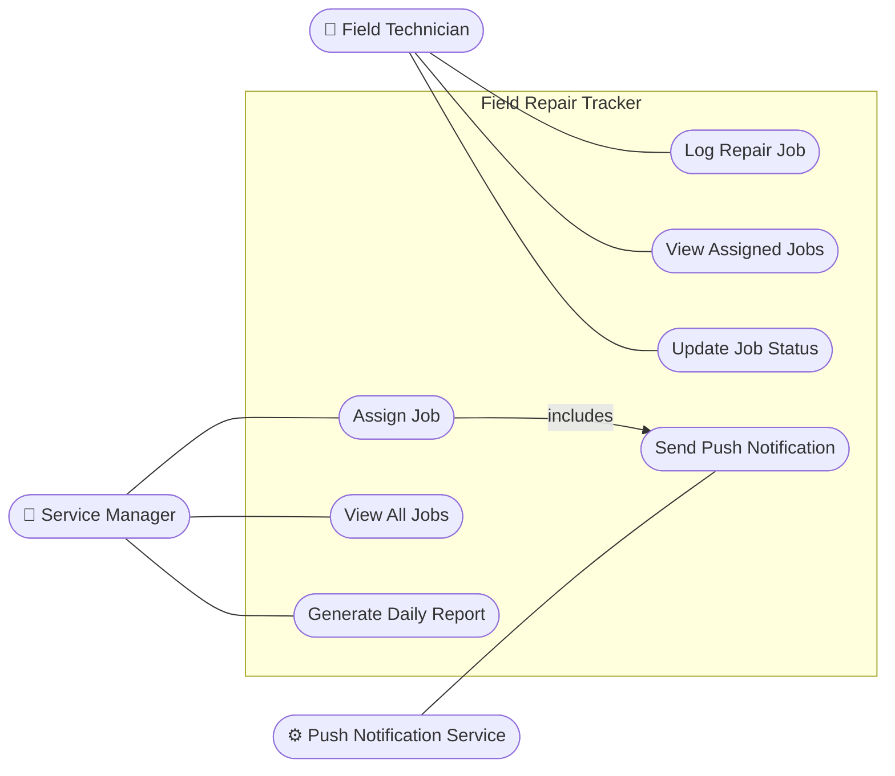
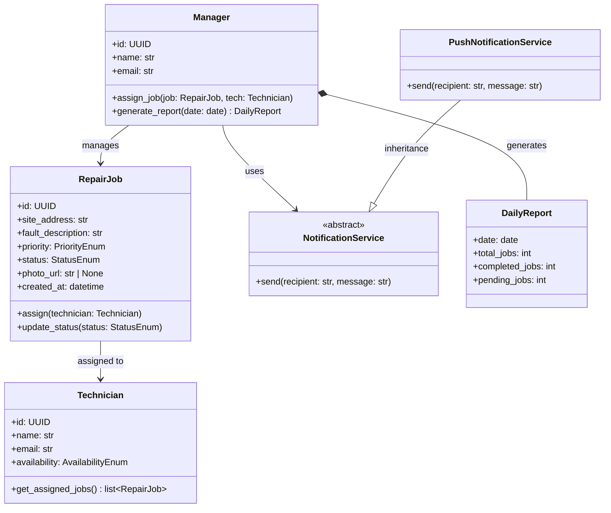
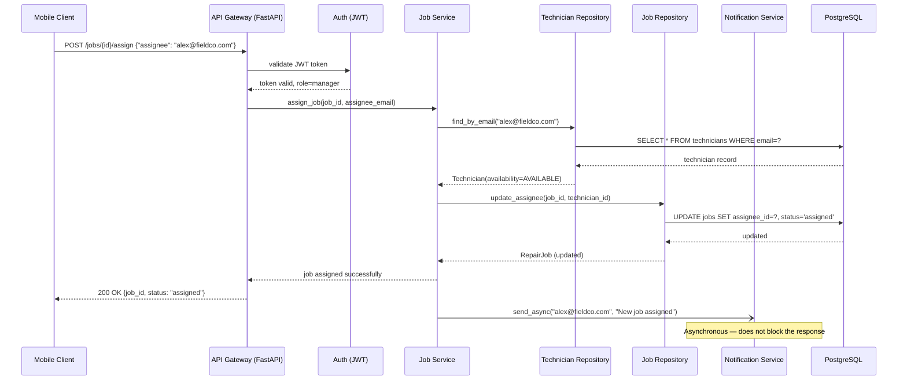

## 6.10 Tutorial: The AI-Assisted SDLC: From Spec to Code

Your stakeholder just sent a brief: field technicians need to log repair jobs from their phones, a manager needs to assign them, and it should "work offline sometimes." That brief is the raw material for this tutorial. By the end, you will have transformed it into a fully specified, designed, and implemented feature — driving an AI agent through requirements, design, and code.

**Concepts covered:** AI-assisted requirements engineering, UML diagram generation and critique, specification-driven code generation

**Format:** Individual | **Duration:** 2 hours | **Tool:** AI Assistant

---

### Outline

- [The Running Scenario](#the-running-scenario)
- [Activity 1 — AI for Requirements Engineering](#activity-1--ai-for-requirements-engineering)
- [Activity 2 — AI for Software Design](#activity-2--ai-for-software-design)
- [Activity 3 — AI for Coding](#activity-3--ai-for-coding)
- [References](#references)

---

### Learning Objectives

By the end of this tutorial, you will be able to:

1. Apply AI coding agents across every phase of the SDLC using a single, evolving scenario.
2. Use prompting techniques to refine vague requirements into well-formed specifications.
3. Direct an AI agent to analyse requirement quality and generate Gherkin acceptance criteria.
4. Use an AI agent to produce UML diagrams from a requirement document and critique their design quality.
5. Generate implementation code from a specification and design artefact using an AI agent.

---

### Prerequisites

- Completed Tutorial 5 — your Python project is set up with uv, pytest, and pre-commit
- Claude Code CLI installed and authenticated ([Claude Code documentation](https://docs.anthropic.com/en/docs/claude-code)); a conversational AI assistant works for Activities 1 and 2 if Claude Code is unavailable
- FastAPI and pytest-cov added to your project: `uv add fastapi "uvicorn[standard]" pytest pytest-cov`

---

### The Running Scenario

Every activity in this tutorial builds on the same system and the same vague, realistic starting point — a request that mirrors real stakeholder briefs.

#### The Starting Brief

> *"We need a system where field technicians can log repair jobs from their phones. A manager should be able to see all the jobs and assign them to technicians. We also want some kind of notification when a job gets assigned. It should be fast and work offline sometimes."*

This brief is intentionally incomplete. It contains:

- **Ambiguous actors**: who exactly is a "field technician"? Can a technician also be a manager?
- **Vague behaviour**: what does "log a repair job" mean? What fields are required?
- **Unresolved constraints**: "work offline sometimes" is not a testable requirement
- **Missing error cases**: what happens when a job is assigned to an unavailable technician?
- **No non-functional measurability**: "fast" is not a requirement

This is the raw material for the activities that follow. By the end of this tutorial, the brief will have been transformed into a fully specified, designed, implemented, and tested feature.

#### The System: Field Repair Tracker

For context, here is the system as it will exist after the activities are complete:

| Property | Value |
|---|---|
| **System name** | Field Repair Tracker |
| **Domain** | Field service management |
| **Primary actors** | Field Technician, Service Manager |
| **External systems** | Push Notification Service (FCM/APNs), PostgreSQL database |
| **Stack** | Python 3.12, FastAPI, PostgreSQL, pytest |
| **Target deployment** | Cloud-hosted API; mobile clients connect over HTTPS |

---

### Activity 1 — AI for Requirements Engineering *(~45 min)*

**Concepts covered:** Requirement elicitation, quality analysis, user story generation, acceptance criteria

In Chapter 2, you learned to elicit requirements from stakeholders and write them in structured formats. In this activity, you will use an AI agent to perform three requirements engineering tasks on the starting brief:

1. **Refinement** — ask the AI to identify ambiguities, ask clarifying questions, and produce a refined requirement set
2. **Quality analysis** — ask the AI to audit the refined requirements against the IEEE 830 quality attributes (correct, unambiguous, complete, consistent, verifiable, traceable, prioritised)
3. **Acceptance criteria generation** — ask the AI to generate Gherkin scenarios for the most important user stories

#### Step 1: Elicitation and Refinement *(~15 min)*

Paste the starting brief into your AI agent and use the following prompt:

<div class="admonish-prompt">

You are an experienced requirements engineer. I will give you a raw client brief for a software system. Your job is to:

1. Identify every ambiguity, gap, or assumption hidden in the brief.
2. For each gap, ask a clarifying question that a real stakeholder could answer.
3. After I answer your questions, produce a refined set of requirements: at least 5 functional requirements in 'The system shall…' format, and at least 3 non-functional requirements that are measurable.

Here is the brief: [paste the starting brief from §7.1.1]

</div>

Answer the AI's clarifying questions using the following stakeholder answers:

- A field technician can only view and update their own jobs; they cannot assign jobs to others
- A service manager can view all jobs, assign any job to any technician, and generate a daily summary report
- "Log a repair job" means: create a job record with a site address, fault description, priority (low / medium / high / critical), and an optional photo attachment
- "Work offline sometimes" means: technicians must be able to view their currently assigned jobs when there is no network connection; creating new jobs requires connectivity
- "Fast" means: the API shall respond to 95% of requests within 300 ms under a load of 200 concurrent users

**Expected output:** A refined requirement set. Save it — you will use it in every subsequent activity.

**Check your output:** Apply the quality attribute table from Chapter 2, §2.4. Can you identify any remaining ambiguities or non-measurable NFRs? Fix them before moving on.

> See [Sample Answer: Activity 1 — Acceptance Criteria](#sample-answer-activity-1--acceptance-criteria) at the end of this tutorial.

#### Step 2: Quality Analysis *(~10 min)*

Ask the AI to audit the requirements it just produced:

<div class="admonish-prompt">

Now audit the requirements you just wrote against the IEEE 830 quality attributes: correct, unambiguous, complete, consistent, verifiable, traceable, and prioritised. For each attribute, give a score of Pass / Partial / Fail and a one-sentence justification. Then list the top 3 requirements most at risk of causing problems downstream if left as-is.

</div>

Review the AI's audit. Do you agree with its assessment? Note any requirements you would rewrite based on its feedback.

> **Important:** AI quality audits are often too generous. The AI produced the requirements and tends to score its own output highly. Read each "Pass" verdict critically — could a developer interpret that requirement in two different ways?

#### Step 3: Activity — User Stories and Acceptance Criteria *(~20 min)*

Ask the AI to generate structured work items:

<div class="admonish-prompt">

From the refined requirements, produce:

1. An epic breakdown — group the requirements into 3–4 epics.
2. For the epic 'Job Lifecycle Management', produce 4 user stories in 'As a [role], I want to [action] so that [benefit]' format.
3. For the user story 'assign a job to a field technician', write acceptance criteria in Gherkin format. Include: one happy-path scenario, one error scenario (technician not available), and one authorisation scenario (a regular technician attempts to assign a job).

</div>

**Check your output:** Are all three acceptance criteria scenarios testable without ambiguity? Could a tester determine pass or fail from each scenario alone, without asking the author?

> See [Sample Answer: Activity 1 — Acceptance Criteria](#sample-answer-activity-1--acceptance-criteria) at the end of this tutorial.

---

### Activity 2 — AI for Software Design *(~45 min)*

**Concepts covered:** UML diagrams, class design, sequence diagrams, design critique

In Chapter 3, you learned to read and produce UML diagrams and to apply design patterns. In this activity, you will direct an AI agent to produce design artefacts from the refined requirements — then critique whether those artefacts reflect good design.

#### Step 1: Use Case Diagram *(~10 min)*

Provide the AI with your refined requirements and ask:

<div class="admonish-prompt">

You are a software architect. Given the requirements below, produce a UML use case diagram in Mermaid syntax. Include all actors (human and system), all use cases, and any include or extend relationships.

Requirements: [paste your refined requirements from Activity 1]

</div>

**Review questions:**
- Are all actors from the requirements represented?
- Is every use case traceable to at least one requirement?
- Does the `includes` relationship correctly capture mandatory sub-behaviours?

> See [Sample Answer: Activity 2 — Use Case Diagram](#sample-answer-activity-2--use-case-diagram) at the end of this tutorial.

#### Step 2: Class Diagram *(~15 min)*

Ask the AI to produce a class diagram:

<div class="admonish-prompt">

Now produce a UML class diagram in Mermaid syntax for the core domain model. Include: all domain classes with their key attributes and methods, all relationships (association, composition, aggregation, inheritance) with labels, and at least one design pattern. Justify your choice of pattern.

</div>

**Design critique prompt:** After the AI produces its class diagram, ask:

<div class="admonish-prompt">

Critique the class diagram you just produced. Identify any violations of SOLID principles, any missing abstractions, and any relationships that could cause problems as the system scales. Suggest two concrete improvements.

</div>

Compare the AI's self-critique with your own reading. Do you agree? Is the `Manager` class doing too much? Should job assignment be delegated to a service layer rather than placed on the `Manager` entity?

> See [Sample Answer: Activity 2 — Class Diagram](#sample-answer-activity-2--class-diagram) at the end of this tutorial.

#### Step 3: Activity — Sequence Diagram *(~20 min)*

Ask the AI to trace the most complex use case end-to-end:

<div class="admonish-prompt">

Produce a UML sequence diagram in Mermaid syntax for the 'Assign Job' use case. The system uses a layered architecture: API Gateway → Service Layer → Repository Layer → Database. The API Gateway validates a JWT token before passing the request to the service layer. After a successful assignment, the service sends a push notification asynchronously.

</div>

**Review questions:**
- Does the diagram show the asynchronous notification correctly — not blocking the HTTP response?
- Is JWT validation happening at the right layer?
- Are all participants visible in the sequence traceable to the class diagram from §7.3.3?

> See [Sample Answer: Activity 2 — Sequence Diagram](#sample-answer-activity-2--sequence-diagram) at the end of this tutorial.

---

### Activity 3 — AI for Coding *(~45 min)*

**Concepts covered:** Specification-driven code generation, code review of AI output, layered architecture

In Chapter 6, you learned that code generation is only as good as the specification that drives it. In this activity, you will use AI Assistant to generate the implementation of the `assign_job` feature — the most complex use case in the system — from the requirements and design artefacts produced in Activities 1 and 2.

#### Step 1: Prepare the Specification

Before invoking the agent, assemble a specification document. Save it as `spec_assign_job.md`:

```markdown
# Specification: Assign Job to Technician

### Context
Field Repair Tracker REST API. Layered architecture: FastAPI → Service Layer → 
Repository Layer → PostgreSQL. Authentication via JWT middleware already implemented.

### Endpoint
POST /jobs/{job_id}/assign

### Access Control
- Only users with role=manager may call this endpoint
- A 403 response is returned for any other role

### Request Body
{
  "assignee_email": "string"   // email address of the technician
}

### Business Rules
1. The job must exist. Return 404 if not found.
2. The technician must exist and have availability=AVAILABLE. Return 409 if not available.
3. On success: update job.assignee_id, set job.status = 'assigned', persist to database.
4. After a successful assignment, send a push notification to the technician 
   asynchronously (do not await — must not block the HTTP response).

### Response (200 OK)
{
  "job_id": "uuid",
  "assignee_email": "string",
  "status": "assigned"
}

### Error Responses
| Code | Condition |
|------|-----------|
| 400  | Request body missing or malformed |
| 403  | Caller is not a manager |
| 404  | Job not found |
| 409  | Technician not found or not available |

### Constraints
- Use dependency injection for the repository and notification service
- All functions must have type annotations
- Do not use global state
- The notification call must be non-blocking (use asyncio.create_task or BackgroundTasks)
```

#### Step 2: Invoke AI Assistant

Open a terminal in your project directory and run:

```bash
claude
```

Then give AI Assistant the following prompt:

<div class="admonish-prompt">

Read spec_assign_job.md. Implement the assign job feature for the Field Repair Tracker API. Produce:

1. `src/domain/repair_job.py` — the RepairJob and Technician domain models as dataclasses
2. `src/repository/job_repository.py` — a JobRepository with find_by_id and update_assignee methods; use an abstract base class
3. `src/service/job_service.py` — an AssignJobService with an assign method that enforces all business rules from the spec
4. `src/api/job_router.py` — the FastAPI router with the POST /jobs/{job_id}/assign endpoint

Follow the constraints in the spec exactly. Use Python 3.12 type annotations throughout.

</div>

#### Step 3: Activity — Review the Generated Code

After generation, review the output against the following checklist. For each item, either confirm it is satisfied or ask the AI to fix it:

| Check | What to look for |
|---|---|
| **Correctness** | Does `assign` raise the right exception for each error condition? |
| **Type safety** | Are all function signatures fully annotated, including return types? |
| **Dependency injection** | Are repository and notification service injected, not imported directly? |
| **Non-blocking notification** | Is the notification call wrapped in `BackgroundTasks` or `asyncio.create_task`? |
| **Status code accuracy** | Does the router return 409 (not 400) for an unavailable technician? |
| **No global state** | Are there any module-level variables that hold mutable state? |

If the AI missed any of these, use a follow-up prompt:

<div class="admonish-prompt">

The notification send is currently blocking the HTTP response. Refactor it to use FastAPI's BackgroundTasks so the response is returned before the notification is sent.

</div>

**After reviewing the output, reflect on the following:**

**AI tends to do well at:**
- Generating boilerplate (dataclasses, Pydantic models, router structure)
- Applying patterns it has seen many times (repository pattern, dependency injection in FastAPI)
- Consistent naming and type annotation when the spec is precise

**AI tends to do poorly at:**
- Distinguishing between 400 and 409 status codes without explicit instruction
- Making notification calls truly non-blocking without being prompted
- Handling subtle business rules ("availability must be AVAILABLE at the time of assignment, not at the time the technician record was last updated")

These are not AI failures — they are specification gaps. Every item the AI gets wrong points to a place where the specification was ambiguous.

---

### Tutorial Summary

AI compresses the time to a first draft — but the quality of that draft is set by the precision of the input. Every gap between the vague starting brief and the working implementation you built in this tutorial was closed not by AI capability but by human judgement: answering clarifying questions, catching SOLID violations, and writing the spec.

---

### Sample Answers

*Attempt each activity fully before expanding these answers. The value of the exercises comes from comparing your AI's output against a reference — not from reading the reference first.*

---

#### Sample Answer: Activity 1 — Acceptance Criteria

<details>
<summary>Click to reveal sample Gherkin acceptance criteria for the Assign Job user story</summary>

```gherkin
Scenario: Successfully assigning a job to an available technician
  Given I am authenticated as a Service Manager
  And a job with ID "job-42" exists with status "unassigned"
  And a technician "alex@fieldco.com" exists and is available
  When I send POST /jobs/job-42/assign with body {"assignee": "alex@fieldco.com"}
  Then the response status is 200
  And the job's assignee is updated to "alex@fieldco.com"
  And the job status changes to "assigned"
  And alex receives a push notification within 10 seconds

Scenario: Attempting to assign a job to an unavailable technician
  Given I am authenticated as a Service Manager
  And a job with ID "job-42" exists
  And technician "alex@fieldco.com" has status "on_leave"
  When I send POST /jobs/job-42/assign with body {"assignee": "alex@fieldco.com"}
  Then the response status is 409
  And the response body contains {"error": "Technician is not available"}

Scenario: Field technician attempts to assign a job
  Given I am authenticated as a Field Technician (not a manager)
  When I send POST /jobs/job-42/assign with body {"assignee": "sam@fieldco.com"}
  Then the response status is 403
  And the response body contains {"error": "Insufficient permissions"}
```

**What to look for in your own output:**
- Each scenario has exactly one `When` — scenarios with multiple actions are testing more than one behaviour
- The happy-path scenario asserts both the data change *and* the side effect (notification)
- The error scenarios assert the specific HTTP status code and error message body, not just "an error occurred"

</details>

---

#### Sample Answer: Activity 2 — Use Case Diagram

<details>
<summary>Click to reveal sample use case diagram in Mermaid</summary>



**What to look for in your own output:**
- The `includes` arrow from Assign Job → Send Push Notification captures that notification is *mandatory*, not optional
- The Field Technician should not have a line to UC4 (Assign Job) — that is a manager-only action
- View All Jobs (UC5) is manager-only; View Assigned Jobs (UC2) is technician-only — these are distinct use cases even though both involve "viewing jobs"

</details>

---

#### Sample Answer: Activity 2 — Class Diagram

<details>
<summary>Click to reveal sample class diagram in Mermaid</summary>



**Known design weaknesses to discuss:**
- The `Manager` class violates the Single Responsibility Principle — it handles both assignment logic and report generation. In a production system, these would move to a `JobAssignmentService` and a `ReportingService`.
- `assign_job` on `Manager` means the Manager entity knows about the NotificationService — this couples a domain object to an infrastructure concern. Assignment logic belongs in a service layer, not on a domain entity.
- `DailyReport` using composition (`*--`) is correct only if a report is generated fresh each time; if reports are persisted, the relationship should be association.

</details>

---

#### Sample Answer: Activity 2 — Sequence Diagram

<details>
<summary>Click to reveal sample sequence diagram in Mermaid</summary>



**What to look for in your own output:**
- The `->>` arrow to Notify should be `--)` or use a `Note` to indicate the call is asynchronous and does not block the response path
- The 200 OK response to the client should appear *before* the notification call in the sequence — if your diagram shows the notification completing before the response is sent, the design is blocking
- JWT validation should happen at the API Gateway layer, not inside the Job Service

</details>

---

### References

- [FastAPI Documentation](https://fastapi.tiangolo.com/) — Web framework used in Activity 3; `APIRouter`, `BackgroundTasks`, dependency injection
- [Mermaid Documentation](https://mermaid.js.org/) — Diagram-as-code syntax used in Activity 2 sample answers
- [Gherkin Reference](https://cucumber.io/docs/gherkin/reference/) — Syntax for the `Given / When / Then` acceptance criteria format used in Activity 1
