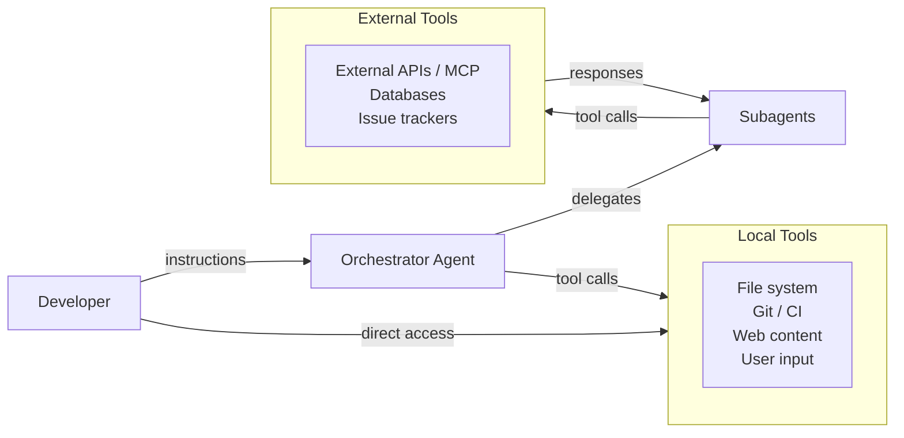

## 9.2 The Threat Model for Agentic Systems

A *threat model* is a structured analysis of who might attack a system, what assets they want, and how they might get them. The standard framework — STRIDE (Spoofing, Tampering, Repudiation, Information Disclosure, Denial of Service, Elevation of Privilege) ([Howard & LeBlanc, 2002](https://learn.microsoft.com/en-us/azure/security/develop/threat-modeling-tool-threats)) — remains useful, but agentic systems introduce several threat vectors that deserve dedicated treatment.

The arrows represent information flows. Every arrow is a potential injection point. The agent trusts — and acts on — information flowing in from all of these sources.

---
