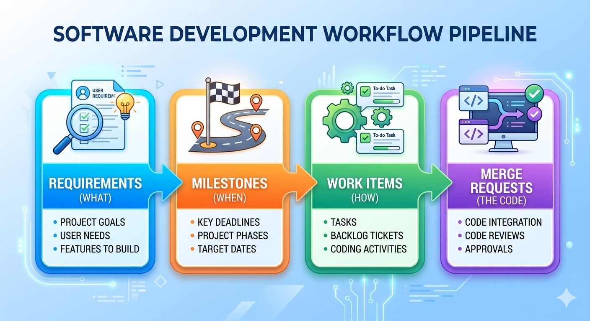

# Tutorial 1: Setting Up Your Python and GitLab for Code and Project Management

Before your first commit reaches a shared repository, three things need to be in place: a reproducible local environment, a protected branch, and a way to track what you're building. This tutorial sets up all three.

---

## Outline

- [Part A: Setting Up Your Python Development Environment](#part-a-setting-up-your-python-development-environment)
- [Part B: Setting Up GitLab for Code Management](#part-b-setting-up-gitlab-for-code-management)
- [Part C: Setting Up GitLab for Project Management](#part-c-setting-up-gitlab-for-project-management)
- [References](#references)

---

## Learning Objectives

By the end of this tutorial, you will be able to:

1. Create an isolated Python project with uv and set up pre-commit hooks.
2. Write and run a Python script and make well-structured Git commits.
3. Configure a protected branch in GitLab and explain why it is necessary for team workflows.
4. Write clear software requirements with measurable acceptance criteria in GitLab.
5. Create a milestone, break a requirement into work items, and estimate effort using GitLab's planning tools.
6. Read a burndown chart and link a merge request to a work item.

---

## Part A: Setting Up Your Python Development Environment

### Prerequisites

- uv ([docs.astral.sh/uv](https://docs.astral.sh/uv/getting-started/installation/)) — manages Python, virtual environments, and packages
- Git ([git-scm.com](https://git-scm.com/))
- VS Code ([code.visualstudio.com](https://code.visualstudio.com/))
- A GitLab account ([gitlab.com](https://gitlab.com/) or [git.infotech.monash.edu](https://git.infotech.monash.edu/) for Monash students)

---

### Step 1: Install uv and Create the Project

#### What Is a Python Package Manager?

When your project depends on third-party libraries — a testing framework, a linter, a web server — you need a way to install them, track which versions you used, and reproduce the same environment on every machine. That is what a package manager does.

Python ships with `pip`, which installs packages from [PyPI](https://pypi.org/). For years it was the default. But `pip` has a significant limitation: it installs packages into whatever Python environment is currently active, with no built-in project isolation and no deterministic lockfile. Two developers running `pip install` on the same `requirements.txt` can end up with different transitive dependency versions, causing bugs that only appear on one machine.

`uv` solves this. It is a modern Python package and project manager built by [Astral](https://astral.sh/) (the same team behind `ruff`). Under the hood it is written in Rust, which makes it 10–100× faster than `pip`. More importantly, it manages the full lifecycle of a Python project:

| Tool | `pip` | `uv` |
|---|---|---|
| Install packages | Yes | Yes |
| Create virtual environments | No (needs `venv`) | Yes (`uv venv`) |
| Lockfile for reproducibility | No (manual `requirements.txt`) | Yes (`uv.lock` — auto-generated) |
| Manage Python versions | No | Yes (`uv python install`) |
| Project scaffold | No | Yes (`uv init`) |
| Speed | Baseline | 10–100× faster |

For a new project in 2025, `uv` is the recommended starting point. `pip` remains useful for quick one-off installs, but for any project that needs reproducibility — which is every professional project — `uv` is the better default.

**Install uv:**

```bash
# macOS/Linux
curl -LsSf https://astral.sh/uv/install.sh | sh
source $HOME/.local/bin/env     # add uv to PATH (or restart terminal)

# Windows (PowerShell)
# powershell -ExecutionPolicy ByPass -c "irm https://astral.sh/uv/install.ps1 | iex"

uv --version                    # e.g. uv 0.6.x
```

**Create the project and activate the virtual environment:**

```bash
uv init my_project
cd my_project

uv venv                         # creates .venv/
source .venv/bin/activate       # macOS/Linux
# .venv\Scripts\activate        # Windows

python --version                # confirm activation
```

`uv init` creates `pyproject.toml`, a starter `hello.py`, and `.python-version` (which pins the Python version for the project). Delete `hello.py` — you will create your own source files below.

#### What Is `pyproject.toml`?

`pyproject.toml` is the single configuration file for a modern Python project. It replaces the older patchwork of `setup.py`, `setup.cfg`, and `requirements.txt`. Defined in [PEP 518](https://peps.python.org/pep-0518/) and [PEP 621](https://peps.python.org/pep-0621/), it is now the standard that all major Python tools — including `uv` — read from by default.

A freshly created file looks like this:

```toml
[project]
name = "my-project"
version = "0.1.0"
description = "Add your description here"
requires-python = ">=3.11"
dependencies = []
```

As you add dev dependencies in Step 3, `uv` will append a `[dependency-groups.dev]` section to this file automatically. By the end of Step 3, `pyproject.toml` is the authoritative record of what the project is and what it depends on.

---

### Step 2: Initialise a Git Repository

```bash
git init
cat > .gitignore << 'EOF'
.venv/
__pycache__/
*.pyc
.env
EOF
git add .gitignore pyproject.toml .python-version
git commit -m "Initial commit: add .gitignore and project config"
```

> **What to commit from `uv init`:** Commit `pyproject.toml` (project metadata and dependencies) and `.python-version` (pins the Python version). Do **not** commit `.venv/`. The `uv.lock` file is added after the first `uv add` in Step 3 — commit it then.

---

### Step 3: Install Core Development Tools

```bash
uv add --dev pre-commit
```

`uv add --dev` records the package under `[dependency-groups.dev]` in `pyproject.toml` and writes an exact `uv.lock` lockfile. Anyone who clones the repository and runs `uv sync` gets an identical environment — no `requirements.txt` needed.

```bash
git add pyproject.toml uv.lock
git commit -m "Add dev dependencies: pre-commit"
```

---

### Step 4: Set Up Pre-commit Hooks

```yaml
# .pre-commit-config.yaml
repos:
  - repo: https://github.com/pre-commit/pre-commit-hooks
    rev: v4.6.0
    hooks:
      - id: trailing-whitespace
      - id: end-of-file-fixer
      - id: check-yaml
      - id: check-added-large-files
```

```bash
uv run pre-commit install
```

These hooks run on every `git commit`: they strip trailing whitespace, ensure files end with a newline, validate YAML syntax, and block accidentally staged large files. If a hook modifies a file, the commit is aborted — stage the fix and commit again.

---

### Step 5: Verify the Setup

Create a small module to confirm the environment works end-to-end:

```python
# src/calculator.py
import argparse


def add(a: float, b: float) -> float:
    return a + b


def divide(a: float, b: float) -> float:
    if b == 0:
        raise ValueError("Cannot divide by zero")
    return a / b


def main() -> None:
    parser = argparse.ArgumentParser(description="Simple calculator")
    parser.add_argument("operation", choices=["add", "divide"], help="Operation to perform")
    parser.add_argument("a", type=float, help="First number")
    parser.add_argument("b", type=float, help="Second number")
    args = parser.parse_args()

    if args.operation == "add":
        print(add(args.a, args.b))
    elif args.operation == "divide":
        print(divide(args.a, args.b))


if __name__ == "__main__":
    main()
```

Run it from the command line:

```bash
python src/calculator.py add 3 5       # Output: 8.0
python src/calculator.py divide 10 2   # Output: 5.0
python src/calculator.py divide 1 0    # Raises: ValueError
```

---

### Step 6: Make Your First Meaningful Commit

With a working script, you are ready to make a proper commit.

**Stage only the files you intend to commit:**

```bash
git add src/calculator.py pyproject.toml .pre-commit-config.yaml uv.lock
```

**Check what is staged before committing:**

```bash
git status
git diff --staged
```

**Write a descriptive commit message.** A good message has a short subject line (under 72 characters) and a body explaining *why* — not just what:

```bash
git commit -m "Add calculator module with add and divide operations

- Implements add() and divide() with type hints
- divide() raises ValueError on division by zero
- CLI entry point via argparse"
```

**View your commit history:**

```bash
git log --oneline
```

Expected output:

```
a3f92c1 Add calculator module with add and divide operations
e1b4d07 Initial commit: add .gitignore
```

---

### Step 7: Understand What Not to Commit

| File / Pattern | Why |
|---|---|
| `.venv/` | Virtual environment — recreatable with `uv sync` |
| `__pycache__/`, `*.pyc` | Python bytecode — generated automatically |
| `.env` | API keys and secrets — never commit credentials |
| `*.egg-info/` | Package build artefacts |

> **`uv.lock` should be committed.** It locks every dependency to an exact version, ensuring all teammates and CI reproduce the same environment. Run `uv sync` after cloning to restore it.

**Verify nothing sensitive is staged:**

```bash
git status
git diff --staged --name-only
```

If you accidentally stage a secret, remove it before committing:

```bash
git restore --staged .env
```

---

### Step 8: Activity — Extend and Commit

1. Add a `multiply(a, b)` function and a `subtract(a, b)` function to `src/calculator.py`.
2. Add CLI support for both operations in `main()`.
3. Verify the new operations work from the command line.
4. Stage and commit with a meaningful message:

```bash
git add src/calculator.py
git commit -m "Add multiply and subtract operations to calculator"
```

5. Verify the commit appears in your log:

```bash
git log --oneline
```

---

## Part B: Setting Up GitLab for Code Management

GitLab hosts your repository and enforces team workflows through **protected branches** — rules that block direct pushes to `main` and require all changes to go through a reviewed merge request.

### What Is a Protected Branch?

When a team collaborates on a shared repository, uncontrolled pushes to the `main` branch can introduce broken code, overwrite teammates' work, and bypass code review. A **protected branch** enforces rules about who can push directly and who must go through a reviewed merge request.

**Why protect `main`?**

| Without protection | With protection |
|---|---|
| Any developer can push directly to `main` | Only maintainers (or no one) can push directly |
| No code review required | All changes must go through a merge request |
| CI/CD pipeline can be bypassed | Pipeline must pass before merging |
| Bugs reach production immediately | Reviewers and automated checks act as a gate |
| Git history can be rewritten (`force push`) | History is preserved — the audit trail is intact |

In professional teams, `main` almost always has branch protection enabled. Feature work happens on short-lived branches; changes reach `main` only through reviewed, approved merge requests.

---

### Setting Up a Protected Branch in GitLab

**Prerequisites:** Maintainer role on the project.

1. In your project, navigate to **Settings > Repository**.
2. Scroll to **Protected branches** and expand the section.
3. In the **Branch** dropdown, select or type `main`.
4. Configure **Allowed to push**:
   - **No one** — forces all changes through merge requests *(recommended for production branches)*
   - **Maintainers** — only maintainers can push directly
   - **Developers + Maintainers** — both roles can push directly
5. Configure **Allowed to merge**:
   - **Maintainers** — only maintainers can approve and merge
   - **Developers + Maintainers** — both roles can merge
6. Click **Protect**.

The recommended setting for most student teams is:

| Setting | Value |
|---|---|
| Allowed to push | No one |
| Allowed to merge | Maintainers (or Developers + Maintainers) |

> **What about force-push?** Force-push protection is enabled automatically on protected branches. This prevents anyone from rewriting history — critical for preserving a shared audit trail.

---

### Verify the Protection Works

After protecting `main`, attempt a direct push to confirm it is blocked:

```bash
git checkout main
echo "test" >> README.md
git add README.md
git commit -m "chore: test direct push"
git push origin main
```

Expected output:

```
remote: GitLab: You are not allowed to push code to protected branches on this project.
To https://gitlab.com/your-team/your-project.git
 ! [remote rejected] main -> main (pre-receive hook declined)
error: failed to push some refs to 'https://...'
```

This rejection confirms the protection is working. All changes to `main` must now go through a merge request.

---

## Part C: Setting Up GitLab for Project Management

GitLab provides a built-in planning suite under the **Plan** menu. The recommended workflow follows a top-down structure:



---

### Step 1: Create a Requirement with Acceptance Criteria

#### What Is a GitLab Requirement?

A **Requirement** in GitLab describes a specific behaviour your product must exhibit. Unlike issues, which represent individual tasks, requirements are long-lived artefacts — they persist until manually archived or marked as satisfied. They capture *what* the system must do, from the perspective of stakeholders and users.

#### How to Create a Requirement

1. In your project, go to **Plan > Requirements**.
2. Click **New requirement**.
3. Enter a **Title** — a short, one-line statement of what the system must do.
4. Enter a **Description** — include context, rationale, and **acceptance criteria** (the conditions under which the requirement is considered satisfied).
5. Click **Create requirement**.

#### Writing Good Requirements

A well-written requirement is:
- **Specific** — describes a single, unambiguous behaviour
- **Testable** — you can write a test to verify it is satisfied
- **User-focused** — describes what the user needs, not how to implement it
- **Complete** — includes clear acceptance criteria with no gaps

| | Example |
|---|---|
| **Bad** | *"The system should be user-friendly and perform well on the login page."* |
| **Good** | *"As a registered user, I can reset my password by entering my email address and receiving a reset link within 2 minutes."* |

**Good requirement with acceptance criteria:**

```markdown
Title: User Password Reset

User Story:
As a registered user, I can reset my password using my email address
so that I can regain access to my account if I forget my credentials.

Acceptance Criteria:
- [ ] A "Forgot password?" link is visible on the login page
- [ ] Submitting a valid registered email sends a reset link within 2 minutes
- [ ] The reset link expires after 24 hours
- [ ] Submitting an unregistered email shows no error (to prevent account enumeration)
- [ ] Clicking the link prompts the user to set a new password
- [ ] The new password must be at least 8 characters long
```

---

### Step 2: Create a Milestone

A **milestone** is a time-boxed goal: a sprint, a release, or a project phase. Work items are assigned to milestones, making it possible to aggregate progress and visualise it on a burndown chart.

#### How to Create a Milestone

1. In your project, go to **Plan > Milestones**.
2. Click **New milestone**.
3. Enter a **Title** — name it after its goal (e.g., `Sprint 1 – User Authentication`).
4. Optionally add a **Description** summarising the sprint goal.
5. Set a **Start date** and **Due date** — these are required for the burndown chart.
6. Click **New milestone**.

> **Tip:** Name milestones by their goal, not just their number. `Sprint 1: User Authentication` is more useful than `Sprint 1` — especially when reviewing old milestones months later.

| Field | Required? | Purpose |
|---|---|---|
| Title | Yes | Identifies the milestone |
| Start date | Recommended | Sets the left axis of the burndown chart |
| Due date | Recommended | Sets the right axis (target completion) |
| Description | Optional | Sprint goal for the team |

---

### Step 3: Break Down a Requirement into Work Items

Requirements describe *what* must be built. Work items (issues) describe the individual *tasks* required to build it. A single requirement typically breaks down into several work items — each small enough to complete in one or two days.

**Example breakdown:**

```
Requirement: User Password Reset
    │
    ├── Issue: Design the password reset email template
    ├── Issue: Implement POST /auth/reset-password API endpoint
    ├── Issue: Add "Forgot password?" link to the login page UI
    ├── Issue: Write integration tests for the reset flow
    └── Issue: Apply rate limiting to the reset endpoint (security)
```

A good breakdown has these properties:

- Each issue has a **single, clear deliverable**
- Issues are **small enough** to close within 1–2 days
- Together, closing all issues satisfies the requirement
- Issues reference the parent requirement for traceability

---

### Step 4: Create Work Items and Link to a Milestone

#### How to Create a Work Item

1. In your project, go to **Plan > Issues** (or use the **+** button in the top bar).
2. Click **New issue**.
3. Enter a **Title** — a clear, actionable statement of the task.
4. Add a **Description** with relevant implementation details and a "Definition of Done" checklist.
5. In the right sidebar, click **Milestone** and select your sprint milestone.
6. Optionally set **Labels** (e.g., `backend`, `frontend`, `testing`), **Assignee**, and **Weight**.
7. Click **Create issue**.

| | Work Item |
|---|---|
| **Bad** | `"Fix the login stuff"` |
| **Good** | `"Implement POST /auth/reset-password API endpoint"` |

**Good work item:**

```markdown
Title: Implement POST /auth/reset-password API endpoint

Description:
Implement the backend endpoint that handles password reset requests.

Behaviour:
1. Accepts POST with body `{ "email": "user@example.com" }`
2. Looks up user by email (return HTTP 200 regardless to prevent enumeration)
3. Generates a secure, time-limited reset token (expires 24 hours)
4. Sends a reset email via the notification service
5. Stores the token hash in the database (never the raw token)

Definition of Done:
- [ ] Endpoint implemented and unit-tested
- [ ] Integration test confirms email is sent for valid addresses
- [ ] Rate limiting applied (max 5 requests / minute per IP)
- [ ] Code reviewed and merged to `main`

Milestone: Sprint 1 – User Authentication
Labels: backend, security
```

---

### Step 5: Estimate Time for Each Work Item

GitLab supports **time tracking** directly on issues. Estimates help the team plan the sprint and contribute to issue weight on the burndown chart.

#### Adding a Time Estimate

1. Open the work item.
2. In the right sidebar, locate the **Time tracking** section.
3. Click **Edit** (pencil icon) next to **Estimated time**.
4. Enter the estimate (e.g. `3h`, `1d`, `30m`) and press **Save**.

#### Logging Actual Time Spent

1. Open the work item.
2. In the right sidebar, locate the **Time tracking** section.
3. Click **Add time entry**.
4. Enter the time spent (e.g. `1h 30m`), optionally select the date, and click **Save**.

GitLab will display a **time tracking widget** on the issue showing estimated vs. actual time — useful for retrospectives and future estimation calibration.

#### Using Issue Weight

**Weight** is a numeric score representing effort or complexity (similar to story points in Scrum). Set it in the issue sidebar. The burndown chart can display progress by weight rather than by issue count — giving a more accurate picture when some issues are significantly larger than others.

| Weight | Rough meaning |
|---|---|
| 1 | Trivial — a small tweak |
| 2–3 | Small — a few hours of work |
| 5 | Medium — a day or two |
| 8+ | Large — consider splitting this issue |

---

### Step 6: Analyse the Burndown Chart

Once issues are assigned to a milestone with a start and due date, GitLab generates a **burndown chart** automatically.

#### Accessing the Charts

1. Go to **Plan > Milestones**.
2. Select your milestone.
3. Scroll to the burndown chart at the bottom of the milestone page.

#### Reading the Burndown Chart

The burndown chart plots remaining open issues (or total weight) for each day of the milestone. A **dotted ideal line** runs straight from the total issue count on Day 1 to zero on the due date.


*Illustrated by Gemini*

| Actual line vs. ideal | What it means |
|---|---|
| **Above** the ideal line | Behind schedule — more issues remain than expected |
| **On** the ideal line | On track |
| **Below** the ideal line | Ahead of schedule |
| **Flat** (not decreasing) | No issues are being closed — team may be blocked |
| **Sudden drop** | Multiple issues closed at once — may signal batching rather than continuous delivery |

| Chart | What it shows | Best for |
|---|---|---|
| **Burndown** | Remaining work declining toward zero | Tracking sprint completion progress |
| **Burnup** | Completed work rising; total work as a second line | Identifying scope creep |

The burnup chart is particularly useful when scope changes mid-sprint. If new issues are added to the milestone, the total-work line rises — making the scope increase immediately visible.

> For example screenshots of both chart types, see the [GitLab Burndown and Burnup Charts documentation](https://docs.gitlab.com/user/project/milestones/burndown_and_burnup_charts/).

---

### Step 7: Create a Merge Request for Each Work Item

Once a work item is ready for implementation, create a branch and merge request directly from the issue. This keeps the code, the task, and the review process linked in one place.

#### How to Create a Merge Request from a Work Item

1. Open the issue.
2. In the right sidebar, click **Create merge request** (or the dropdown arrow to set branch options).
3. GitLab creates a new branch named after the issue (e.g., `12-implement-post-auth-reset-password`) and a corresponding **draft merge request**.
4. Work on the branch locally:

```bash
git fetch origin
git checkout 12-implement-post-auth-reset-password

# Make your changes, then:
git add src/auth/reset_password.py tests/test_reset_password.py
git commit -m "feat: implement POST /auth/reset-password endpoint"
git push origin 12-implement-post-auth-reset-password
```

5. When the work is complete, open the merge request on GitLab and **mark it Ready** (remove the Draft status).
6. Assign at least one reviewer.
7. The MR is blocked from merging to `main` by the protected branch rule until it is approved.

#### Closing an Issue via a Merge Request

Add a closing keyword to the MR description to automatically close the linked issue when the MR merges:

```
Closes #12
```

When the MR is merged, Issue #12 is automatically closed and the burndown chart updates immediately.

**Supported closing keywords:** `Closes`, `Fixes`, `Resolves` (case-insensitive).

---

## References

- [GitLab Protected Branches](https://docs.gitlab.com/ee/user/project/protected_branches.html) — Configuring branch protection rules
- [GitLab Requirements](https://docs.gitlab.com/user/project/requirements/) — Creating and managing long-lived requirements
- [GitLab Milestones](https://docs.gitlab.com/ee/user/project/milestones/) — Setting up and managing milestones
- [GitLab Time Tracking](https://docs.gitlab.com/ee/user/project/time_tracking.html) — Estimates, spending, and the time tracking widget
- [GitLab Burndown and Burnup Charts](https://docs.gitlab.com/user/project/milestones/burndown_and_burnup_charts/) — Reading and interpreting progress charts
- [GitLab Merge Requests](https://docs.gitlab.com/ee/user/project/merge_requests/creating_merge_requests.html) — Creating merge requests and linking them to issues
