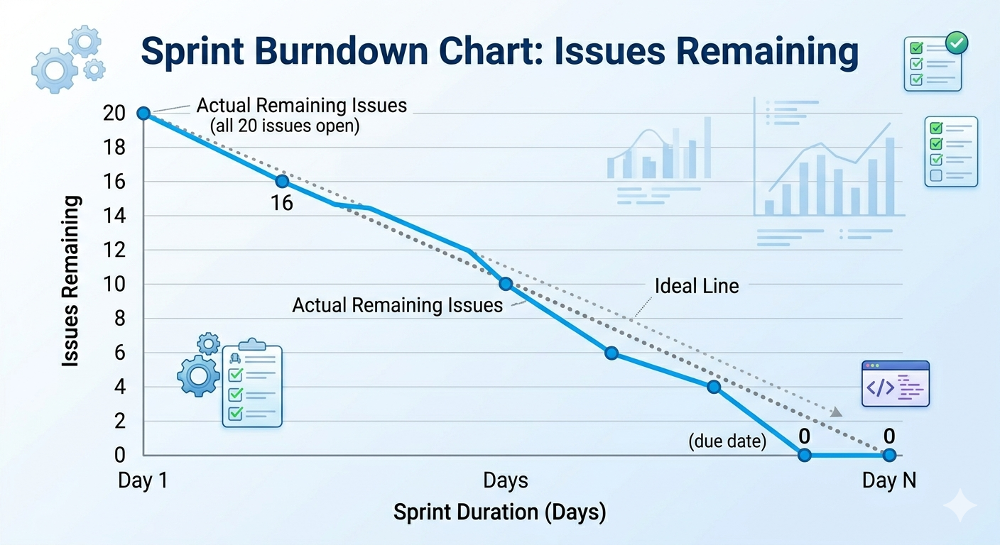

# Tutorial 2: Setting Up GitLab for Code and Project Management

This tutorial walks through two complementary aspects of using GitLab professionally: **code management** through protected branches, and **project management** using GitLab's built-in planning tools — Requirements, Milestones, Work Items, and Burndown Charts.

---

## Outline

- [Part A: Code Management — Protected Branches](#part-a-code-management--protected-branches)
- [Part B: Project Management](#part-b-project-management)
  - [Step 1: Create a Requirement with Acceptance Criteria](#step-1-create-a-requirement-with-acceptance-criteria)
  - [Step 2: Create a Milestone](#step-2-create-a-milestone)
  - [Step 3: Break Down a Requirement into Work Items](#step-3-break-down-a-requirement-into-work-items)
  - [Step 4: Create Work Items and Link to a Milestone](#step-4-create-work-items-and-link-to-a-milestone)
  - [Step 5: Estimate Time for Each Work Item](#step-5-estimate-time-for-each-work-item)
  - [Step 6: Analyse the Burndown Chart](#step-6-analyse-the-burndown-chart)
  - [Step 7: Create a Merge Request for Each Work Item](#step-7-create-a-merge-request-for-each-work-item)
- [Activity](#activity)
- [References](#references)

---

## Learning Objectives

By the end of this tutorial, you will be able to:

1. Set up a protected branch in GitLab and explain why branch protection matters.
2. Write clear software requirements with measurable acceptance criteria.
3. Create a milestone and break a requirement into actionable work items.
4. Estimate task effort using GitLab time tracking.
5. Read a burndown chart and interpret the health of a sprint.
6. Link a merge request to a work item and track its status through the milestone.

---

## Part A: Code Management — Protected Branches

### What Is a Protected Branch?

When a team collaborates on a shared repository, uncontrolled pushes to the `main` branch can introduce broken code, overwrite teammates' work, and bypass code review. A **protected branch** enforces rules about who can push directly and who must go through a reviewed merge request.

**Why protect `main`?**

| Without protection | With protection |
|---|---|
| Any developer can push directly to `main` | Only maintainers (or no one) can push directly |
| No code review required | All changes must go through a merge request |
| CI/CD pipeline can be bypassed | Pipeline must pass before merging |
| Bugs reach production immediately | Reviewers and automated checks act as a gate |
| Git history can be rewritten (`force push`) | History is preserved — the audit trail is intact |

In professional teams, `main` almost always has branch protection enabled. Feature work happens on short-lived branches; changes reach `main` only through reviewed, approved merge requests.

### Setting Up a Protected Branch in GitLab

**Prerequisites:** Maintainer role on the project.

1. In your project, navigate to **Settings > Repository**.
2. Scroll to **Protected branches** and expand the section.
3. In the **Branch** dropdown, select or type `main`.
4. Configure **Allowed to push**:
   - **No one** — forces all changes through merge requests *(recommended for production branches)*
   - **Maintainers** — only maintainers can push directly
   - **Developers + Maintainers** — both roles can push directly
5. Configure **Allowed to merge**:
   - **Maintainers** — only maintainers can approve and merge
   - **Developers + Maintainers** — both roles can merge
6. Click **Protect**.

The recommended setting for most student teams is:

| Setting | Value |
|---|---|
| Allowed to push | No one |
| Allowed to merge | Maintainers (or Developers + Maintainers) |

> **What about force-push?** Force-push protection is enabled automatically on protected branches. This prevents anyone from rewriting history — critical for preserving a shared audit trail.

### Verify the Protection Works

After protecting `main`, attempt a direct push to confirm it is blocked:

```bash
git checkout main
echo "test" >> README.md
git add README.md
git commit -m "chore: test direct push"
git push origin main
```

Expected output:

```
remote: GitLab: You are not allowed to push code to protected branches on this project.
To https://gitlab.com/your-team/your-project.git
 ! [remote rejected] main -> main (pre-receive hook declined)
error: failed to push some refs to 'https://...'
```

This rejection confirms the protection is working. All changes to `main` must now go through a merge request.

---

## Part B: Project Management

GitLab provides a built-in planning suite under the **Plan** menu. The recommended workflow follows a top-down structure:


*Illustrated by Gemini*

---

## Step 1: Create a Requirement with Acceptance Criteria

### What Is a GitLab Requirement?

A **Requirement** in GitLab describes a specific behaviour your product must exhibit. Unlike issues, which represent individual tasks, requirements are long-lived artefacts — they persist until manually archived or marked as satisfied. They capture *what* the system must do, from the perspective of stakeholders and users.

### How to Create a Requirement

1. In your project, go to **Plan > Requirements**.
2. Click **New requirement**.
3. Enter a **Title** — a short, one-line statement of what the system must do.
4. Enter a **Description** — include context, rationale, and **acceptance criteria** (the conditions under which the requirement is considered satisfied).
5. Click **Create requirement**.

### Writing Good Requirements

A well-written requirement is:
- **Specific** — describes a single, unambiguous behaviour
- **Testable** — you can write a test to verify it is satisfied
- **User-focused** — describes what the user needs, not how to implement it
- **Complete** — includes clear acceptance criteria with no gaps

**Acceptance criteria** define observable, verifiable conditions. They are typically written as a checklist in the requirement description.

### Good vs. Bad Requirement

| | Example |
|---|---|
| **Bad** | *"The system should be user-friendly and perform well on the login page."* |
| **Good** | *"As a registered user, I can reset my password by entering my email address and receiving a reset link within 2 minutes."* |

The bad example is vague and untestable. "User-friendly" and "perform well" mean different things to different people; no acceptance criterion can confirm the requirement is ever satisfied.

**Good requirement with acceptance criteria:**

```markdown
Title: User Password Reset

User Story:
As a registered user, I can reset my password using my email address
so that I can regain access to my account if I forget my credentials.

Acceptance Criteria:
- [ ] A "Forgot password?" link is visible on the login page
- [ ] Submitting a valid registered email sends a reset link within 2 minutes
- [ ] The reset link expires after 24 hours
- [ ] Submitting an unregistered email shows no error (to prevent account enumeration)
- [ ] Clicking the link prompts the user to set a new password
- [ ] The new password must be at least 8 characters long
```

**Bad requirement — avoid:**

```markdown
Title: Fix login

Description:
Make the login page better and address any issues users might have with it.
```

This has no acceptance criteria, is not testable, and could mean anything. Two developers reading this requirement would build two different things.

---

## Step 2: Create a Milestone

A **milestone** represents a time-boxed goal — a sprint, a release, or a project phase. Work items are assigned to milestones, making it possible to aggregate progress and visualise it on a burndown chart.

### How to Create a Milestone

1. In your project, go to **Plan > Milestones**.
2. Click **New milestone**.
3. Enter a **Title** — name it after its goal (e.g., `Sprint 1 – User Authentication`).
4. Optionally add a **Description** summarising the sprint goal.
5. Set a **Start date** and **Due date** — these are required for the burndown chart.
6. Click **New milestone**.

> **Tip:** Name milestones by their goal, not just their number. `Sprint 1: User Authentication` is more useful than `Sprint 1` — especially when reviewing old milestones months later.

| Field | Required? | Purpose |
|---|---|---|
| Title | Yes | Identifies the milestone |
| Start date | Recommended | Sets the left axis of the burndown chart |
| Due date | Recommended | Sets the right axis (target completion) |
| Description | Optional | Sprint goal for the team |

---

## Step 3: Break Down a Requirement into Work Items

Requirements describe *what* must be built. Work items (issues) describe the individual *tasks* required to build it. A single requirement typically breaks down into several work items — each small enough to complete in one or two days.

**Example breakdown:**

```
Requirement: User Password Reset
    │
    ├── Issue: Design the password reset email template
    ├── Issue: Implement POST /auth/reset-password API endpoint
    ├── Issue: Add "Forgot password?" link to the login page UI
    ├── Issue: Write integration tests for the reset flow
    └── Issue: Apply rate limiting to the reset endpoint (security)
```

A good breakdown has these properties:

- Each issue has a **single, clear deliverable**
- Issues are **small enough** to close within 1–2 days
- Together, closing all issues satisfies the requirement
- Issues reference the parent requirement for traceability

---

## Step 4: Create Work Items and Link to a Milestone

### How to Create a Work Item

1. In your project, go to **Plan > Issues** (or use the **+** button in the top bar).
2. Click **New issue**.
3. Enter a **Title** — a clear, actionable statement of the task.
4. Add a **Description** with relevant implementation details and a "Definition of Done" checklist.
5. In the right sidebar, click **Milestone** and select your sprint milestone.
6. Optionally set **Labels** (e.g., `backend`, `frontend`, `testing`), **Assignee**, and **Weight**.
7. Click **Create issue**.

### Good vs. Bad Work Item

| | Work Item |
|---|---|
| **Bad** | `"Fix the login stuff"` |
| **Good** | `"Implement POST /auth/reset-password API endpoint"` |

A good work item has a **single, clear task**, is **small enough to complete in a day or two**, and includes enough context for anyone on the team to pick it up.

**Good work item:**

```markdown
Title: Implement POST /auth/reset-password API endpoint

Description:
Implement the backend endpoint that handles password reset requests.

Behaviour:
1. Accepts POST with body `{ "email": "user@example.com" }`
2. Looks up user by email (return HTTP 200 regardless to prevent enumeration)
3. Generates a secure, time-limited reset token (expires 24 hours)
4. Sends a reset email via the notification service
5. Stores the token hash in the database (never the raw token)

Definition of Done:
- [ ] Endpoint implemented and unit-tested
- [ ] Integration test confirms email is sent for valid addresses
- [ ] Rate limiting applied (max 5 requests / minute per IP)
- [ ] Code reviewed and merged to `main`

Milestone: Sprint 1 – User Authentication
Labels: backend, security
Estimate: /estimate 3h
```

**Bad work item — avoid:**

```markdown
Title: Authentication

Description:
Do the authentication stuff for the sprint.
```

### The Burndown Chart: Viewing Work Item Status

On the **milestone detail page** (Plan > Milestones > select your milestone), GitLab displays a summary of issue status above the burndown chart:

| Status | Meaning |
|---|---|
| **Unstarted** | Open issues with no assignee or recent activity |
| **Ongoing** | Open issues that are assigned or have had recent activity |
| **Completed** | Closed issues |

This gives an at-a-glance view of sprint health without opening every issue individually.

---

## Step 5: Estimate Time for Each Work Item

GitLab supports **time tracking** directly on issues. Estimates help the team plan the sprint and contribute to issue weight on the burndown chart.

### Adding a Time Estimate

1. Open the work item.
2. In the right sidebar, locate the **Time tracking** section.
3. Click **Edit** (pencil icon) next to **Estimated time**.
4. Enter the estimate (e.g. `3h`, `1d`, `30m`) and press **Save**.

### Logging Actual Time Spent

1. Open the work item.
2. In the right sidebar, locate the **Time tracking** section.
3. Click **Add time entry**.
4. Enter the time spent (e.g. `1h 30m`), optionally select the date, and click **Save**.

GitLab will display a **time tracking widget** on the issue showing estimated vs. actual time — useful for retrospectives and future estimation calibration.

### Using Issue Weight

**Weight** is a numeric score representing effort or complexity (similar to story points in Scrum). Set it in the issue sidebar. The burndown chart can display progress by weight rather than by issue count — giving a more accurate picture when some issues are significantly larger than others.

| Weight | Rough meaning |
|---|---|
| 1 | Trivial — a small tweak |
| 2–3 | Small — a few hours of work |
| 5 | Medium — a day or two |
| 8+ | Large — consider splitting this issue |

---

## Step 6: Analyse the Burndown Chart

Once issues are assigned to a milestone with a start and due date, GitLab generates a **burndown chart** automatically.

> **Availability:** Burndown and burnup charts require GitLab **Premium** or **Ultimate**, including GitLab for Education.

### Accessing the Charts

1. Go to **Plan > Milestones**.
2. Select your milestone.
3. Scroll to the burndown chart at the bottom of the milestone page.

### Reading the Burndown Chart

The burndown chart plots remaining open issues (or total weight) for each day of the milestone. A **dotted ideal line** runs straight from the total issue count on Day 1 to zero on the due date.



*Illustrated by Gemini*

**Interpreting the actual line:**

| Actual line vs. ideal | What it means |
|---|---|
| **Above** the ideal line | Behind schedule — more issues remain than expected |
| **On** the ideal line | On track |
| **Below** the ideal line | Ahead of schedule |
| **Flat** (not decreasing) | No issues are being closed — team may be blocked |
| **Sudden drop** | Multiple issues closed at once — may signal batching work rather than continuous delivery |

### Burndown

GitLab provides both chart types. Toggle between them on the milestone page.

| Chart | What it shows | Best for |
|---|---|---|
| **Burndown** | Remaining work declining toward zero | Tracking sprint completion progress |
| **Burnup** | Completed work rising; total work as a second line | Identifying scope creep |

The burnup chart is particularly useful when scope changes mid-sprint. If new issues are added to the milestone, the total-work line rises — making the scope increase immediately visible, rather than hiding it as a compression of the burndown line.

> For example screenshots of both chart types, see the [GitLab Burndown and Burnup Charts documentation](https://docs.gitlab.com/user/project/milestones/burndown_and_burnup_charts/).

---

## Step 7: Create a Merge Request for Each Work Item

Once a work item is ready for implementation, create a branch and merge request directly from the issue. This keeps the code, the task, and the review process linked in one place.

### How to Create a Merge Request from a Work Item

1. Open the issue.
2. In the right sidebar, click **Create merge request** (or the dropdown arrow to set branch options).
3. GitLab creates a new branch named after the issue (e.g., `12-implement-post-auth-reset-password`) and a corresponding **draft merge request**.
4. Work on the branch locally:

```bash
git fetch origin
git checkout 12-implement-post-auth-reset-password

# Make your changes, then:
git add src/auth/reset_password.py tests/test_reset_password.py
git commit -m "feat: implement POST /auth/reset-password endpoint"
git push origin 12-implement-post-auth-reset-password
```

5. When the work is complete, open the merge request on GitLab and **mark it Ready** (remove the Draft status).
6. Assign at least one reviewer.
7. The MR is blocked from merging to `main` by the protected branch rule until it is approved — enforcing code review automatically.

### Closing an Issue via a Merge Request

Add a closing keyword to the MR description to automatically close the linked issue when the MR merges:

```
Closes #12
```

When the MR is merged, Issue #12 is automatically closed and the burndown chart updates immediately — showing one fewer open issue in the sprint.

**Supported closing keywords:** `Closes`, `Fixes`, `Resolves` (case-insensitive).

---

## Activity

You will use a shared GitLab project for this activity. The project simulates a small team building a simple **To-Do List web application**.

### Task 1 — Protect the Main Branch

1. Go to **Settings > Repository > Protected branches**.
2. Protect `main` with: **Allowed to push: No one**, **Allowed to merge: Maintainers**.
3. Verify the protection by attempting a direct push — confirm it is rejected with the expected error message.

### Task 2 — Write a Requirement

The following requirement is poorly written. Identify what makes it bad and rewrite it.

**Given (bad) requirement:**

```
Title: Search

Description:
Users should be able to search for things easily.
```

Write an improved version with:
- A clear, specific title
- A user story in the description
- At least 4 measurable acceptance criteria

### Task 3 — Create a Milestone

Create a milestone called `Sprint 1 – Core Features` with:
- A start date of today
- A due date one week from today
- A one-sentence description of the sprint goal

### Task 4 — Break Down the Requirement and Create Work Items

Break your Task 2 requirement into at least 3 work items. For each issue:
1. Write a clear, actionable title
2. Add a description with a "Definition of Done" checklist
3. Assign it to the Sprint 1 milestone
4. Add a time estimate using `/estimate`

### Task 5 — Create a Merge Request

For one of your work items:
1. Create a branch and merge request from the issue using GitLab's **Create merge request** button
2. Make a small code change on the branch (e.g., add a placeholder function)
3. Push the change and mark the MR as **Ready for review**
4. Confirm the MR appears on the issue and is listed in the milestone

### Task 6 — Analyse the Burndown Chart

1. Close 2–3 of your work items to simulate completed work.
2. Navigate to **Plan > Milestones** and open your Sprint 1 milestone.
3. View the burndown chart and answer:
   - Is the sprint on track, ahead, or behind the ideal line?
   - What is the count of **Unstarted**, **Ongoing**, and **Completed** issues?
   - Switch to the burnup view — what would a rising total-issues line indicate?

---

## References

- [GitLab Requirements](https://docs.gitlab.com/user/project/requirements/) — Creating and managing long-lived requirements
- [GitLab Milestones](https://docs.gitlab.com/ee/user/project/milestones/) — Setting up and managing milestones
- [GitLab Burndown and Burnup Charts](https://docs.gitlab.com/user/project/milestones/burndown_and_burnup_charts/) — Reading and interpreting progress charts
- [GitLab Protected Branches](https://docs.gitlab.com/ee/user/project/protected_branches.html) — Configuring branch protection rules
- [GitLab Time Tracking](https://docs.gitlab.com/ee/user/project/time_tracking.html) — Estimates, spending, and the time tracking widget
- [GitLab Merge Requests](https://docs.gitlab.com/ee/user/project/merge_requests/creating_merge_requests.html) — Creating merge requests and linking them to issues
