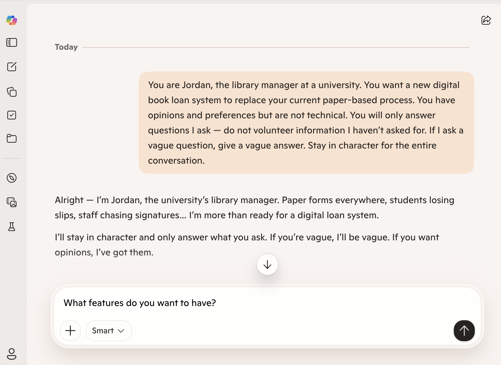

# Tutorial 2: Eliciting Requirements from AI As Your Client

**Concepts covered:** Elicitation techniques, requirements specification, quality attributes, conflict resolution, scope management

**Format:** Individual or pairs | **Duration:** ~2.5 hours | **Tool:** AI Assistant

Most requirements failures happen before a line of code is written — not because engineers lack the ability to build, but because no one asked the right questions. In this tutorial, an AI assistant stands in for your client. Over seven steps you will conduct a stakeholder interview, convert the transcript into specification artefacts, audit their quality against IEEE criteria, discover a second stakeholder whose needs conflict with the first, and respond to scope creep mid-project — covering the full requirements engineering lifecycle from §2.1 in a controlled, repeatable setting where the only limit is the precision of your questions.

---

## Outline

- [Step 1 — Elicitation Interview](#step-1--elicitation-interview-25-min)
- [Step 2 — Produce Artefacts](#step-2--produce-artefacts-20-min)
- [Step 3 — Acceptance Criteria and Definition of Done](#step-3--acceptance-criteria-and-definition-of-done-25-min)
- [Step 4 — Requirements Quality Audit](#step-4--requirements-quality-audit-20-min)
- [Step 5 — Conflict Injection](#step-5--conflict-injection-20-min)
- [Step 6 — Scope Creep Simulation](#step-6--scope-creep-simulation-15-min)
- [Step 7 — Reflection](#step-7--reflection-15-min)
- [References](#references)

---

## Learning Objectives

By the end of this tutorial, you will be able to:

1. Conduct a semi-structured elicitation interview with an AI-simulated stakeholder and document requirements from the transcript.
2. Write functional requirements, non-functional requirements, user stories, and a MoSCoW priority table from a real interview transcript.
3. Write Gherkin acceptance criteria covering a happy path and an error or edge case for each user story.
4. Write a Definition of Done with at least 6 items spanning functional correctness, code quality, non-functional validation, and deployment.
5. Audit a set of requirements against the seven IEEE quality attributes and write corrected versions of failing requirements.
6. Identify and resolve conflicts between competing stakeholder requirements using documented MoSCoW trade-offs.
7. Classify incoming scope change requests as scope creep or missed requirements and write a structured change response.

---

## Step 1 — Elicitation Interview *(~25 min)*

Prompt AI Assistant with the following system prompt at the start of your conversation:

<div class="admonish-prompt">
You are Jordan, the founder of a small retail business. You want to build a new online shopping application to sell your products directly to customers, replacing your current manual order-taking process via phone and email. You have opinions and preferences but are not technical. You will only answer questions I ask — do not volunteer information I haven't asked for. If I ask a vague question, give a vague answer. Stay in character for the entire conversation.
</div>


*An example UI of [Microsoft Copilot](https://copilot.microsoft.com/) as an AI Client.*

Conduct a semi-structured interview with Jordan using the elicitation techniques from §2.2.1. Log every question and your AI Assistant's response in a worksheet.

**Requirements:**
- Ask at least **8 questions**
- Cover at least **3 stakeholder concerns** (e.g., product browsing, checkout and payment, order management)
- Use at least **one follow-up question** that digs deeper into a vague answer

> **Tip:** Your AI Assistant will not give you everything you need unless you ask the right questions. Vague questions will produce vague answers — just as in real stakeholder interviews.

---

## Step 2 — Produce Artefacts *(~20 min)*

From your interview transcript, produce the following:

1. **4 functional requirements** in "The system shall…" format
2. **2 non-functional requirements** — each must be measurable (apply the test from §2.3.2)
3. **2 user stories** in "As a [role]…" format
4. **A MoSCoW table** with at least 5 features prioritised

---

## Step 3 — Acceptance Criteria and Definition of Done *(~25 min)*

### Part A — Acceptance Criteria *(~15 min)*

For each of your 2 user stories from Step 2, write acceptance criteria in Gherkin format (§2.8). Each user story must have:

- **1 happy path scenario** — the successful case
- **1 error or edge case scenario** — invalid input, missing data, or unauthorised access

**Example structure:**

```gherkin
Scenario: [descriptive name]
  Given [initial context]
  When  [action taken]
  Then  [observable outcome]
```

> **Check:** Can each scenario be tested without ambiguity? If a tester cannot determine pass or fail from the scenario alone, rewrite it.

### Part B — Definition of Done *(~10 min)*

Write a **Definition of Done** (§2.9) for your online shopping application project. It must include at least **6 items** covering:

- Functional correctness (acceptance criteria)
- Code quality (testing, review)
- Non-functional validation (performance, security)
- Deployment and documentation

Compare your DoD with another pair. Identify one item they included that you missed, and add it with a one-sentence justification for why it belongs.

---

## Step 4 — Requirements Quality Audit *(~20 min)*

Swap your requirements artefacts with another pair. Audit each other's requirements against the IEEE quality criteria from §2.4:

| Requirement | Correct | Unambiguous | Complete | Consistent | Verifiable | Traceable | Prioritised |
|---|---|---|---|---|---|---|---|
| FR-01 | | | | | | | |
| FR-02 | | | | | | | |
| FR-03 | | | | | | | |
| FR-04 | | | | | | | |
| NFR-01 | | | | | | | |
| NFR-02 | | | | | | | |

Mark each cell ✓ (satisfies the attribute), ✗ (fails), or ? (unclear). For every ✗, write a one-sentence explanation of the flaw and a corrected version of the requirement.

---

## Step 5 — Conflict Injection *(~20 min)*

Start a new AI Assistant conversation with this persona:

<div class="admonish-prompt">You are Sam, a frequent online shopper in their late 20s. You shop on your phone and expect a fast, frictionless experience — ideally guest checkout with no account required. You find long forms and mandatory registration frustrating. Stay in character.
</div>

Interview Sam for 10 minutes, then:

1. Identify **at least 2 conflicts** between Jordan's requirements and Sam's
2. Document each conflict explicitly — which requirement from each stakeholder, and why they are incompatible
3. Propose a written resolution for each: either a requirement that satisfies both stakeholders, or a justified MoSCoW trade-off that explicitly records what was deferred and why

---

## Step 6 — Scope Creep Simulation *(~15 min)*

Your instructor will send the following message, simulating a client email received mid-project:

> *"Hi team — Jordan here. I forgot to mention, we'd also love the app to integrate with our Instagram and Facebook pages so customers can buy directly from our social media posts. Also, can it support a loyalty points system? Oh, and my business partner just asked if we could add a B2B wholesale portal for bulk orders."*

For each new request:

1. Classify it using MoSCoW — does it change any existing priorities?
2. Determine whether it is **scope creep** or a legitimate missed requirement, and justify your decision
3. Write a one-paragraph **change response** to Jordan that acknowledges all three requests, documents what is accepted or deferred, and explains why

---

## Step 7 — Reflection *(~15 min)*

Answer the following questions individually in writing:

1. After the quality audit, which quality attribute (§2.4) was hardest to satisfy in your requirements — and why?
2. Could the conflict between Jordan and Sam have been discovered from a single stakeholder interview? What does this tell you about elicitation breadth?
3. Which of Jordan's scope creep requests was hardest to classify — the social media integration, loyalty points, or B2B portal — and why?
4. What can your AI Assistant not replicate compared to a real stakeholder interview? Think about §2.2.3 (observation and tacit knowledge).
5. Where in this activity did your AI Assistant add genuine value — and where did it fall short?

---

## References

- [Gherkin Reference](https://cucumber.io/docs/gherkin/reference/) — Syntax for writing Given/When/Then acceptance criteria scenarios (Step 3)
- [ISO/IEC/IEEE 29148:2018](https://www.iso.org/standard/72052.html) — Requirements engineering standard underlying the quality attributes used in Step 4
- [Microsoft Copilot](https://copilot.microsoft.com/) — One example of an AI assistant suitable for the client simulation role in Steps 1 and 5
